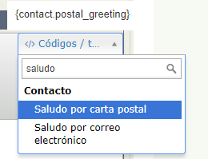

Comunicaciones por correo postal
================================

Este capítulo trata sobre las distintas formas en las que CiviCRM ayuda con
envíos por postal y con las campañas de correo postal. Ayudará si ya conoce
profundamente los aspectos clave de las búsquedas en CiviCRM así como los campos
personalizados, actividades, perfiles y como realizar unificaciones de correo
usando software de procesador de word.

 

Planificando el envio de correos
--------------------------------

Antes de empezar cualquier actividad de comunicación, dedique tiempo a
identificar sus objetivos y planifique los pasos a seguir. Para realizar un
envio de correos hay varias preguntas que hay que plantearse:

-   ¿Qué tipo de envío va a mandar a sus integrantes?

-   ¿Los envíos se realizan siempre a todos los miembros de la base de datos o
    se dirigen habitualmente a un grupo determinado de contactos?

-   ¿Cómo quiere saludar a sus destinatarios? (p.ej. "Querida Laura" o "Querida
    Laura González")?

Hay tres maneras de usar CiviCRM para envíos de correo:

1.  Crear etiquetas: imprimir etiquetas estándard de direcciones en las que no
    necesitará personalizar el contenido, por ejemplo para enviar un folleto
    impreso.

2.  Exportar contactos y realizar envíos combinados a una herramienta externa
    (como Openoffice o Microsoft Word). Consulte el capítulo sobre Exportación
    que encontrará en un capítulo anterior de esta sección para más detalles.

3.  Utilice la función de Imprimir cartas PDF de CiviCRM para realizar la
    combinación directamente (vea los detalles a continuación).

Muchas organizaciones sin ánimo de lucro de EE.UU. tienen que clasificar los
destinatarios de un envío basándose en su código postal para realizar envíos
masivos. Si esto aplica a su organización, es recomendable crear las etiquetas
de su envío utilizando un procesador word en el que podrá controlar la secuencia
de clasificación, mejor que en CiviCRM. Puede utilizar la misma hoja de datos
para su envío combinado.

Saludos y Despedidas
--------------------

Puede establecer un saludo postal determinado para cada contacto. Existen varias
opciones desde el cercano"Querido Juan"a una opción más formal "Querido Sr. Juan
Martínez". También puede introducir un *saludo personalizado* ("Su Majestad
real"). Los saludos postales pueden editarse en la sección de Preferencias de
Comunicación del formulario de edición del contacto. Si necesita establecer o
reestablecer saludos postales masivos, consulte el capítulo de "Trabajos
programados" en esta sección y documéntese en la wiki:

<http://wiki.civicrm.org/confluence/display/CRMDOC/Update+Greetings+and+Address+Data+for+Contacts>

Imprimir Cartas PDF
-------------------

El flujo de trabajo consiste en primero seleccionar los contactos a los que
quiere dirigirse, luego elija *imprimir carta* como una opción para el lote. A
continuación se generarán las cartas como documentos PDF permitiéndole
imprimirlas fácilmente.

Para crear una carta:

1.  Vaya a **Buscar > Búsqueda Avanzada**; si quiere imprimir las cartas para
    los miembros de un grupo vaya a **Contactos > Administrar Grupos** y haga
    clic en "Contactos" junto al Grupo que desee.

2.  Introduzca los criterios de búsqueda que necesite y haga clic en Buscar (no
    aplicable si está utilizando un Grupo).

3.  Seleccione los contactos que recibirán la carta.

4.  Desde el menú desplegable de Acciones, elija "Imprimir/Fusionar documento".
    (En anteriores versiones de CiviCRM esta acción se llamaba "Imprimir cartas
    PDF para contactos").

5.  Revise el formato de la página seleccionado y haga cualquier ajuste deseado.
    Aquí es donde puede configurar el tamaño del papel, márgenes y la
    orientación del papel.

6.  Introduzca su texto y haga ajustes de formato en el editor WYSIWYG editor.
    También puede introducir archivos de imagen como el logo de su organización
    o una firma.  Haga clic en la parte del cuerpo de la carta donde quiera que
    aparezca la imagen y haga clic en el icono de la imagen.

7.  Puede personalizar la carta usando códigos/tokens; por ejemplo, Los Saludos
    Postales es un código/token muy usado en esta situación. Haga clic en el
    cuerpo de la carta donde quiere introducir el token.  Luego haga clic en
    "Introducir Tokens"situado en la parte de arriba a la derecha de la carta y
    luego seleccione el token deseado.

1.  Antes de que cambie de que cambie a la pantalla siguiente,  decida si el
    formato de esta carta será usado de nuevo.  Si es así, marque la casilla
    "Guardar como nueva plantilla" e introduzca un nombre en el campo "Título de
    la plantilla".

2.  Cuando su carta esté terminada, desplácese hasta la abajo y haga clic en
    "Descargar Documento".

3.  Una ventana emergente le ofrecerá la opción de abrir o guardar el PDF (esta
    es la misma notificación que su navegador le daría para cualquier descarga).
    Abra el archivo, revise sus cartas y luego imprímalas o guárdelas y
    revíselas tranquilamente, cuando pueda.

Puede usar esta función para todo tipo de documentos, no solo cartas.  Por
ejemplo, podría usarlas para imprimir certificados de asistencia a un taller.

Crear Etiquetas para envíos 
----------------------------

Crear etiquetas para envíos es una función muy fácil y útil.

1.  Realice la búsqueda para seleccionar los contactos a los que se quiere
    dirigir.

2.  Elija **Etiquetas de correo** del menú desplegable de **Acciones**.

3.  Seleccione el estilo de la etiqueta

4.  Decida si quiere excluir a las personas que han elegido la opción "No enviar
    correo" en sus opciones de privacidad  (marcado por defecto y recomendado) y
    si quiere combinar en una etiqueta los registros que tengan la misma
    dirección postal.

Esta última opción es muy útil cuando se realice un envío a una familia u
organización en las que no quiere que reciban correos duplicados.  Cuando los
registros se combinan, cada nombre en esa dirección se lista en una línea
separada en la etiqueta.

El administrador de su sistema puede configurar los campos incluídos en las
etiquetas de envío.  Lea la información sobre configuración de direcciones en el
capítulo de Contactos, para aprender más sobre otras opciones.

 
