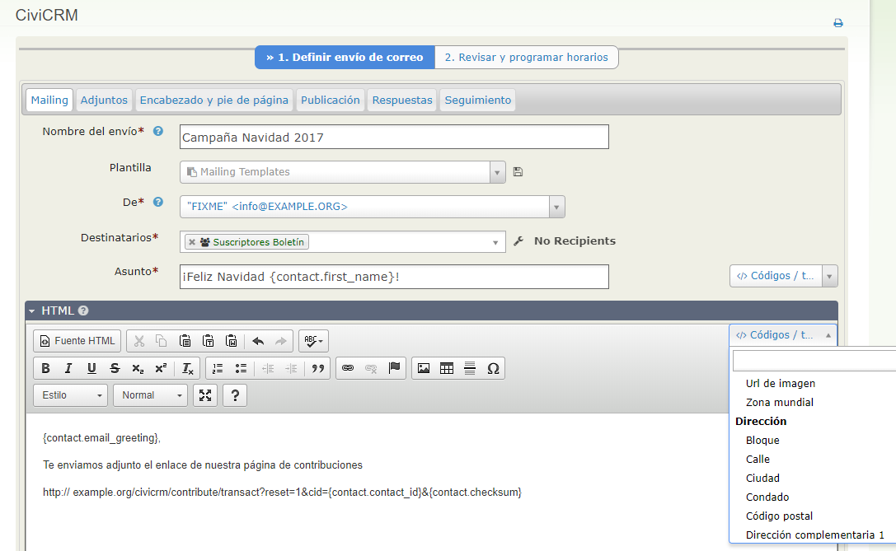

Códigos/Tokens y correo combinado
=================================

Puede usar la información de la base de datos de CiviCRM para configurar
comunicaciones de combinación de envíos de correo, tanto para correos
electrónicos como para material impreso como cartas y etiquetas de envío. La
funciónalidad de la combinación de envíos de correo depende de tokens que
representan elementos en su base de datos. Este capítulo explica como funcionan
los tokens y cómo los puede usar para generar materiales de impresión. Usar
tokens en correos electrónicos se trata más adelante en la sección Email de esta
guía.

Códigos/Tokens
---------------------------------------------------------------------------------------------------------

Los códigos o tokens son los equivalentes a los campos de combinación de envíos
de correo en CiviCRM. Esto significa que es posible introducir información de la
base de datos en un correo electrónico o una carta que es distinta para cada
destinatario. Por ejemplo, usar el token de Saludo Postal para incluir un saludo
personalizado para cada destinatario en sus cartas PDF. La mayoría de los campos
de contactos, incluyendo los campos personalizados que haya creado, están
disponibles como tokens de combinación de envío de correos. Puede ver los tokens
disponibles haciendo clic en el enlace **Inserte Token** en la esquina superior
derecha del área de edición de mensajes.

La mayoría de los tokens contienen información que está en los campos de la base
de datos. Sin embargo, existen algunos tokens especiales que cumplen una tarea
determinada, como un enlace a una página de baja de suscripción o un enlace para
elegir el formato del correo electrónico. Algunos tokens solo están disponibles
para correos masivos, como el token que facilita un enlace hacia un mensaje
almacenado online.

### Token de checksum

Un token particularmente útil es checksum. El checksum le permite ofrecer a
otras personas, enlaces a formularios de contribuciones, perfiles, peticiones y
a formularios de registro en eventos que están ya completados con información
que está registrada en como información del contacto.

La imagen de arriba muestra un ejemplo de esto.

Solo los campos de contacto y acciones pueden ser introducidos en los correos
electrónicos como tokens. Los registros relacionados, como el nombre del evento
del que los contactos tienen inscripciones pendientes, no pueden ser incluídos.
Sin embargo, podría proporcionar un enlace en el panel de control del contacto
de la persona, para que puedan revisar los detalles de registro por ellos mismos
(una vez hayan iniciado sesión) , o podría usar un token de checksum para
permitir el acceso a un perfil, a través del cual puedan modificar su
información sin tener que iniciar sesión.

Vaya a esta página para obtener más detalles sobre cómo usar el token de
checksum: <http://wiki.civicrm.org/confluence/display/CRMDOC/Tokens>.

### Tokens personalizados

También es posible obtener tokens personalizados creados por un desarrollador.
Por ejemplo, la cantidad total de contribuciones de un contacto. Para saber más
de cómo trabajar con tokens personalizados, consulte la discusión sobre tokens
de combinación de envíos de correo personalizado en el capítulo de Hooks de la
sección extendida de CiviCRM de la guía y busque en la wiki:

<http://wiki.civicrm.org/confluence/display/CRMDOC/Tokens>.

Otra tarea para un desarrollador es crear si/luego lógica para su combinación de
envío de correos. Esto se hace usando el lenguaje de plantilla inteligente como
se describe en:<http://www.smarty.net/docs/en/language.function.if.tpl>.
