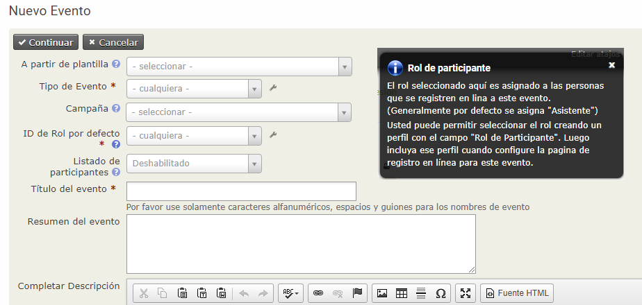
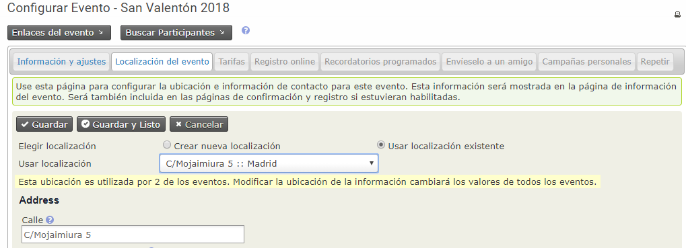
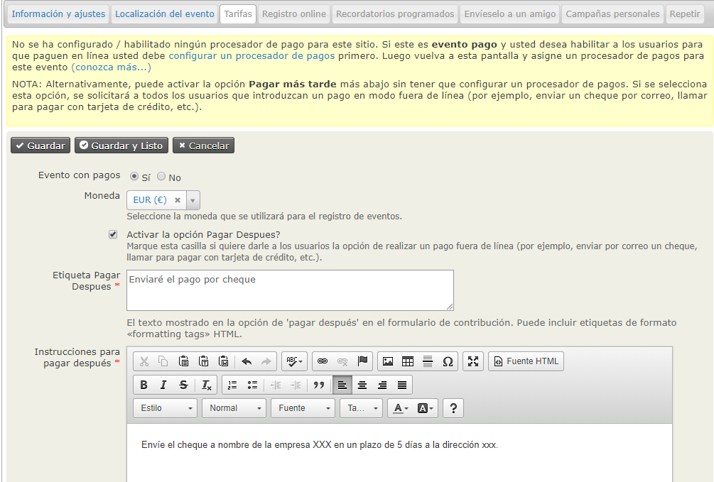
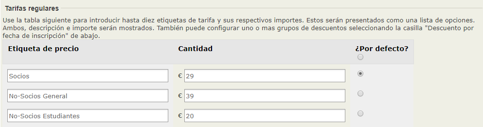
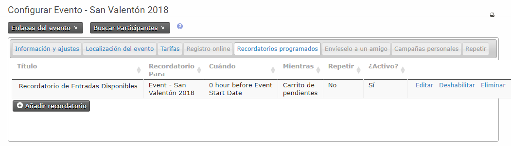
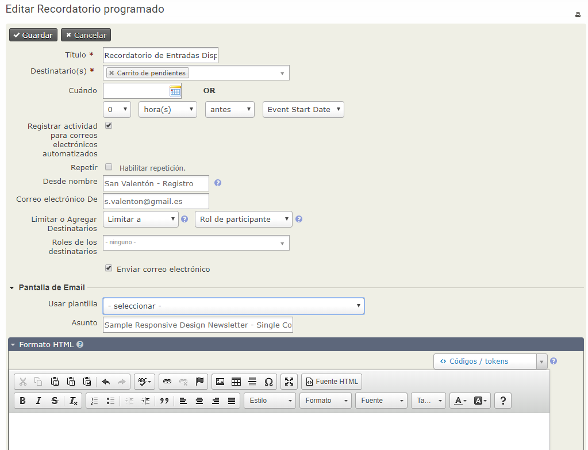
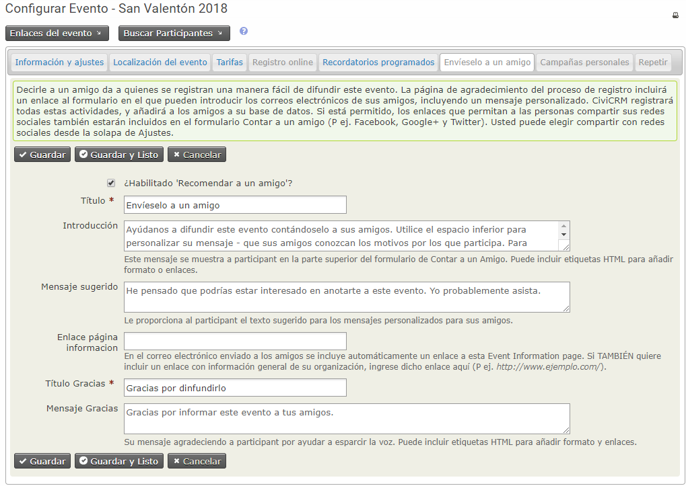
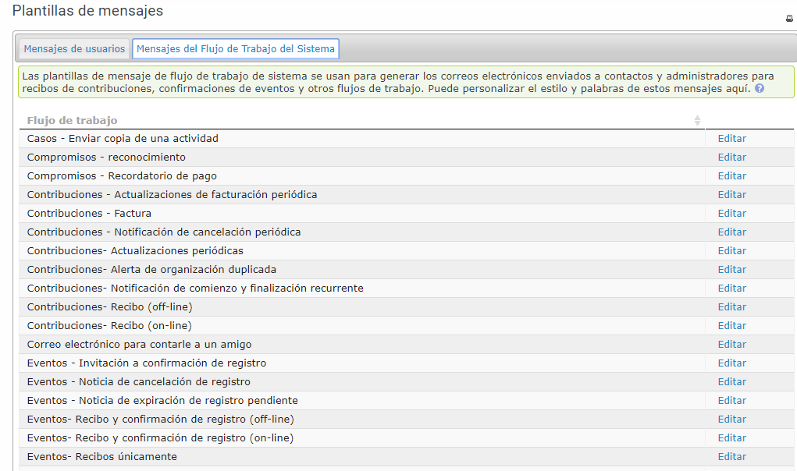

Creando un Evento
=================

Este capítulo cubre cómo crear un nuevo evento describiendo cada una de las opciones de configuración disponibles en la pantalla de creación de eventos. Si va a permitir el registro en línea para el evento, le interesará leer el capítulo *registro de eventos en línea*. De lo contrario, podrá consultar el capítulo *registro de evento manual*.

Para comenzar, cree un nuevo evento seleccionando **Eventos > Nuevo evento** en el menú. (Si no puede ver el menú de eventos, asegúrese de haber habilitado el componente Eventos. Puede hacerlo en **Administrar > Configurar > Configuración global > Activar componentes**.)

Información y Configuración del Evento
---------------------------------------

La primera página que ves al crear un evento solicita información básica. Puede hacer clic en cualquiera de los signos de interrogación azules para que muestren la información de ayuda para cada uno de los campos. Cuando vea un lápiz, al hacer clic en él, accederá a una pantalla donde puede editar las opciones disponibles. Tenga en cuenta que, dependiendo de sus permisos, es posible que no pueda editar estas opciones y, por lo tanto, no verá el lápiz.

**A partir de la plantilla** le permite crear un evento a partir de una plantilla (consulte el capítulo *Plantillas de evento* en esta sección) en lugar de crear uno desde cero.

**Tipo de evento** le permite categorizar el evento.

Si tiene **CiviCampaign** habilitado, puede seleccionar una campaña para que esto sea parte de (vea la sección *Campaña* para obtener más detalles).

** ID del rol por defecto ** distinguen diferentes tipos de participantes del evento, como asistentes, oradores y personal. ¿Qué papel deberían asignar los participantes cuando se registran en línea para este evento? El valor colocado en este campo se asignará por defecto cuando los usuarios se registren en línea o cuando importe contactos a menos que incluya el campo Rol de participante con otros valores en su archivo de importación CSV. El valor más común es el asistente.

¿Desea que los usuarios vean una lista de participantes y, cuánta información sobre los participantes desea revelar? **Los listados de participantes** muestran la relevancia de un evento y pueden ayudar a generar interés dentro de su comunidad constituyente. Tenga en cuenta que las opciones que define en esta sección solo *habilitan* los listados de participantes, para que estén visibles, deberá crear un elemento en el menú o un enlace a la lista en algún lugar de su sitio web. Una vez que haya creado el evento, se mostrará el enlace de la lista de participantes en la página de configuración del evento. Consulte el capítulo * Gestión de eventos * para obtener información sobre listas de participantes y otras formas de promocionar sus eventos.

¿Cómo se llama tu evento? El **Título del evento** aparecerá en las páginas de información del evento, páginas de registro, listas de eventos y en la página administrativa de Gestión de eventos. Asegúrese de elegir un título significativo y que represente claramente su evento.

Los siguientes dos campos (**Resumen del evento** y **Descripción completa**) le permiten describir su evento. Tanto el resumen como la descripción completa se incluirán en las páginas de información del evento. Utilice el editor de texto enriquecido proporcionado para el campo de descripción para incluir fotos, imágenes y texto formateado.

Inserte **Fecha / hora de inicio** y **Fecha / hora de finalización** para su evento. Estos se incluirán en la página de información del evento y en las listas de eventos.

Puede establecer un **Número máximo de participantes** para cada evento y definir un mensaje que se mostrará cuando se alcance ese número.

Si desea visualizar un mapa que muestre la ubicación del evento, puede hacerlo utilizando Google Maps o Open Street Maps (deberá configurar la aplicación elegida a través de **Administrar > Configuración del sistema > Asignación y geocodificación**).

Seleccione la casilla **Evento público** para incluir el evento en listas promocionales como fuentes RSS, archivos o fuentes de iCal y páginas de listas de eventos.

Seleccione ** Permitir compartir a través de las redes sociales ** para incluir enlaces de redes sociales para compartir este evento en la página de información del evento, página de agradecimiento, página de Invita Amigos (si está habilitada) y en los correos electrónicos de confirmación de eventos.

Por último, tiene la opción de activar o desactivar este evento. Si cree que le llevará un tiempo completar la configuración de su evento, considere desactivarlo hasta que esté completo para asegurarse de que no aparezca inadvertidamente en las fuentes de la lista de eventos. Puede activar fácilmente el evento cuando esté listo para comenzar a publicitarlo.

Después de revisar los detalles en esta página, haga clic en **Continuar >** para crear su evento y avanzar al siguiente paso. Puede interrumpir la configuración en cualquier página subsiguiente haciendo clic en **Guardar y Listo** y luego volver para revisar y modificar cualquiera de las configuraciones.

Para volver a un evento guardado, vaya a **Eventos > Administrar eventos** y haga clic en **Configurar** para seguir trabajando en el evento.

Lugar del Evento
-----------------

El siguiente paso es completar la ubicación y los detalles de contacto para el evento.

Una vez que haya insertado la ubicación de un evento, puede reutilizarlo para eventos posteriores haciendo clic en ** Usar ubicación existente ** y seleccionarlo de la lista desplegable. Tenga en cuenta que si elige una ubicación existente y la edita, actualizará esa ubicación para todos los eventos que la utilicen.

También puede incluir varios números de teléfono y direcciones de correo electrónico en la página de información del evento para dar, a los solicitantes de registro, la posibilidad de contactar a los organizadores del evento directamente. Si el evento se celebra en un lugar diferente de la ubicación principal de su organización, es posible que también desee proporcionar información de contacto para la ubicación de la reunión.

Tarifas
--------

Si el evento es gratuito, configure el botón de ** Evento de pago ** en **No**, luego haga clic en ** Guardar ** y salte al Registro en línea.

Si se trata de un evento de pago, haga clic en **Sí**. La pantalla mostrará las opciones disponibles (consulte el siguiente conjunto de capturas de pantalla).

¿Qué tipo de **contribución** (tipo financiero) se asignará a los registros pagados para este evento? Aunque el valor más común para este campo es simplemente Precio de evento, CiviCRM brinda la flexibilidad de definir múltiples tipos financieros y asignarlos a diferentes eventos según sea necesario. Consulte *Configuración* en la sección *Contribuciones* para obtener más información.

Si planea aceptar pagos con tarjeta de crédito a través del formulario de registro en línea, debe configurar un **procesador de pagos** antes de crear su evento. Encuentre más información sobre esto, consulte *Procesadores de pago* en la sección *Contribuciones*.

¿Desea permitir que los participantes paguen más tarde enviando un cheque por correo postal, pagando en el lugar del evento con efectivo o tarjeta de crédito u organizando otro método de pago? De ser así, puede habilitar la opción ** Pagar más tarde ** y definir una etiqueta e instrucciones de pago. Si mantiene este campo sin marcar, los participantes deberán pagar con tarjeta de crédito.

** Tarifas regulares ** proporcionan un conjunto de niveles de precios a elegir (por ejemplo, un registro individual por \ $ 50 o un registro familiar por \ $ 100). Cada cantidad de tarifa tiene una etiqueta asignada y puede establecer una tarifa por defecto. Este enfoque funciona bien para muchos eventos y es fácil de configurar. Aquí hay un ejemplo simple:

Si su evento requiere una estructura de precios más compleja, con más opciones o complementos adicionales, es posible que desee utilizar ** conjuntos de precios ** o **descuentos**. Para obtener más información al respecto, consulte el capítulo *Tarifas de eventos complejos* en esta sección.

Registro Online
-------------------

Permitir que las personas se registren en línea (autoservicio) a través de su sitio web ofrece muchos beneficios. El registro en línea es muy práctico para sus socios y contactos y puede ahorrarle tiempo y recursos. Si no necesita ofrecer el registro en línea, no marque **Permitir registro en línea** y continúe con el siguiente paso. Si desea permitir el registro en línea, consulte el capítulo *Registro de eventos en línea* en esta sección.

Recuerdos Programados
----------------------

Los recordatorios programados se pueden usar para enviar automáticamente correos electrónicos a los participantes del evento en ciertos momentos, antes o después del evento, por ejemplo

- una semana antes: recuérdeles que deben consultar el calendario de la conferencia

- un día después: pídales que completen el formulario de comentarios

- Dos días antes del pago pendiente de un participante pendiente con opción a Pago Posterior: adviértales que su registro se cancelará si no proporcionan detalles de pago en las próximas 48 horas.

Para configurar un recordatorio programado para un evento específico, haga clic en la pestaña de recordatorios programados, que le mostrará los recordatorios programados ya existentes para este evento (si corresponde) y haga clic en **Agregar recordatorio**.

Complete los detalles en este formulario para enviar, por ejemplo, un correo electrónico a todos los ponentes registrados 3 días antes de la fecha de inicio del evento. Tenga en cuenta que puede limitar los destinatarios según su estado (registrado, atendido, etc.) y también por función (ponente, asistente, voluntario, etc.). Puede usar una plantilla o redactar su propio mensaje en el cuadro de formato HTML.

Además de configurar recordatorios por evento, también puede configurarlos según el tipo de evento específico y puede agrégarlos a plantillas de eventos específicos. La idea es básicamente la misma que la anterior, pero puede acceder a esta funcionalidad desde **Administrar > Comunicaciones > Recordatorios programados**.

Envíaselo a un amigo
---------------------
CiviEvent hace que sea fácil aprovechar el poder de las redes sociales de sus contactos comprometidos al permitirles compartir rápida y fácilmente detalles sobre su organización y evento con sus amigos y colegas. El paso final en la creación del evento es una página donde puede habilitar las funcionalidades de "Envíaselo a un amigo". Puede definir el texto y los enlaces que se incluirán en esa página y en el correo electrónico enviado desde la herramienta (consulte la siguiente captura de pantalla).

Se agregará un registro de actividad de "Envíaselo a un amigo" a la pestaña Actividades del participante cada vez que envíe correos a sus amigos. Esto le permitirá rastrear a sus seguidores más activos y fidelizarlos más allá. Las personas que a las que se envía un correo electrónico utilizando esta función también se agregan automáticamente a CiviCRM como contactos.

Confirmación de Registro y Recibo
----------------------------------------

Puede enviar confirmaciones automáticas y correos electrónicos de recibos a los participantes que se registran a un evento, ya sea que se inscriban en línea o bien sean registrados por su personal o voluntarios. El contenido y el diseño de estos correos electrónicos están controlados por plantillas de mensajes. * Se proporcionan formatos HTML y de texto. Puede modificar o agregar texto a estos correos electrónicos, o agregar marcas como un logotipo a las versiones HTML. Para configurar una dirección de correo electrónico desde la que enviar la confirmación y los recibos, consulte Configuración en la sección Correo electrónico.

Vaya a ** Administrar > Comunicaciones > Plantillas de mensajes ** (que se muestra en la siguiente captura de pantalla) y haga clic en la pestaña ** Mensajes del flujo de trabajo del sistema ** para ver la lista de mensajes que puede modificar. Haga clic en ** Editar ** junto a "Eventos - Confirmación de registro y recibo" para editar el contenido y el diseño.

Las plantillas para estos mensajes incluyen tanto el texto mostrado como la lógica del programa necesaria. Tenga cuidado al editar para no modificar la lógica del programa. Asegúrese de probar el flujo de trabajo y revisar los correos electrónicos enviados después de realizar cualquier cambio. Si encuentra que los cambios han causado problemas, errores o información incompleta, siempre puede volver a los valores predeterminados del sistema para ese flujo de trabajo.
