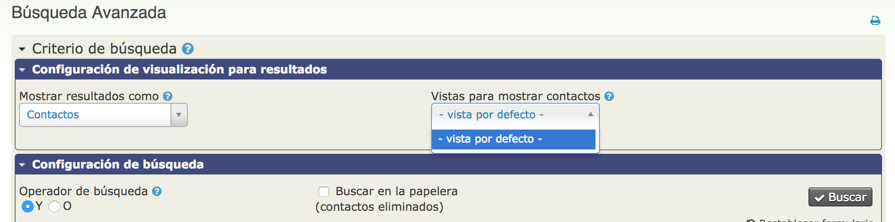

Personalización de la interfaz de usuario
=========================================

CiviCRM es altamente flexible y personalizable. Este capítulo proporciona información sobre las distintas maneras en que puede cambiar la interfaz para adaptarla a sus necesidades y a las de sus usuarios. Cómo personalizar los datos está explicado detalladamente en la sección **Organizando su información** y en los capítulos **¿Qué necesita saber?** y **Configuración** de las secciones de los distintos componentes de CiviCRM (por ej: aprenda cómo personalizar los tipos de eventos en la sección de **Eventos**)

Cambiar las opciones desplegables
---------------------------------

Las opciones incluidas en los campos desplegables que se ven en los formularios de entrada / edición de contactos en CiviCRM se pueden modificar (agregar, cambiar el nombre, deshabilitar o eliminar opciones) en **Administrar > Pantallas y Datos Personales > Opciones de Lista Desplegables**. Estas incluyen:

-	Opciones de Género
-	Prefijos y sufijos individuales (por ejemplo, Sra., Sr. y Jr., Sr.)
-	Tipos de teléfono (por ejemplo, Teléfono, Móvil, Pager)
-	Servicios de mensajería instantánea (por ejemplo, Yahoo, MSN, AIM, GTalk, Jabber y Skype)
-	Tipos de sitios web (por ejemplo, Trabajo, Facebook, Twitter)
-	Tipos de ubicación (por ejemplo, Inicio, Trabajo, Facturación, Principal).Tenga en cuenta que la ubicación "Facturación" se asigna a direcciones de facturación cuando los contactos realizan una contribución, pagan por eventos o se dan de alta como miembros. Los nombres de tipo de ubicación no pueden contener espacios.

Las opciones en métodos de comunicación preferidos (por ejemplo, teléfono, correo electrónico, correo postal, SMS) en el formulario de edición / entrada de contacto también se pueden modificar, vaya a **Administrar > Comunicaciones > Métodos Preferidos de Comunicación.**
La modificación de las opciones desplegables de entidades del sistema -como tipos de actividad, tipos de relación, etc.- está fuera del alcance de este capítulo; consulte el apartado de *Organizando sus datos* y las secciones de los diferentes componentes de CiviCRM.

Cambiar las preferencias de visualización
-----------------------------------------

Si hay tipos de actividades que no registra o categorías de datos que no recopila, puede hacer que estos campos y pestañas no aparezcan cuando sus usuarios inicien sesión en CiviCRM. Esto puede hacer mucho más sencillo la adopción del sistema y su correcta utilización.
Para ello, vaya a **Administrar > Pantallas y datos personalizados > Preferencias de Visualización.**
Puede cambiar las pestañas disponibles en la ficha del contacto, marcando y desmarcando las casillas correspondientes en la sección **Ver Contacto:**

Por ejemplo, si su organización no está usando el módulo de CiviCase (para gestionar casos), podría desmarcar esa casilla y la pestaña correspondiente ya no aparecerá en la interfaz de usuario. Si después decide empezar a usarlo, simplemente vuelva a marcar casilla. La información almacenada en las pestañas ocultas permanece en la base de datos.
Puede cambiar los bloques de información que aparecen al editar un contacto marcando y desmarcando las casillas correspondientes, en la sección **Editando Contactos:**

Por ejemplo, si su organización no recopila datos demográficos o preferencias de comunicación, puede desmarcarlos para simplificar la pantalla de edición. Al igual que con las preferencias de contactos en la visualización, cualquier información contenida en campos que elija no mostrar permanecerá en la base de datos y puede volver a mostrarla en cualquier momento cambiando las casillas seleccionadas en esta pantalla.

###Deshabilitar formularios emergentes (Popup)

La interfaz de usuario CiviCRM utiliza habitualmente cuadros de diálogo emergentes (Popups) para facilitar la edición de datos. Puede desactivar esta función y limitar la interfaz a la navegación tradicional desmarcando la casilla *Habilitar Formularios Popup* en **Administrar > Pantallas y datos personalizados > Preferencias de visualización**. Tenga en cuenta que CiviCRM será más lento con esta función desactivada ya que cada formulario requerirá una carga de página completa en el navegador.

Personalización de las preferencias de búsqueda
-----------------------------------------------

Puede cambiar el comportamiento de búsqueda predeterminado de CiviCRM en **Administrar > Pantallas y datos personalizados > Preferencias de Búsquedas**. Las opciones disponibles están explicadas en el capítulo Configuración inicial > Instalación y configuración básica > Preferencias de búsqueda de esta guía

Si su base de datos es grande y sus búsquedas son lentas, considere deshabilitar algunas de estas opciones para aumentar su velocidad.

En la sección de **Administrar > Pantallas y datos personalizados > Preferencias de visualización** existe un bloque para de configurar las opciones que deberían ser incluidas en los formularios de Búsqueda Básica y Avanzada. Por ejemplo: Si no hace un seguimiento de Relaciones - entonces usted no necesita esta sección incluida en el formulario de búsqueda avanzada. Simplifique el formulario desmarcando esta opción.

Estas casillas de verificación modifican las pantallas Buscar > Buscar contactos y Buscar > Búsqueda avanzada. Desmarque las casillas para eliminar los tipos de campos correspondientes de las pantallas de búsqueda.

Personalización de las preferencias de fecha 
--------------------------------------------

Las preferencias de visualización predeterminadas para las fechas se establece en **Administrar > Localización> Formatos de Fecha.**

Puede modificar esta configuración predeterminada y definir el intervalo de fechas aceptadas algunos campos específicos en **Administrar > Pantallas y datos personalizados > Preferencias de fecha.** CiviCRM proporciona intervalos de fechas predeterminados para algunos campos específicos. Por ejemplo, el rango predeterminado para las Fechas de Actividad es de 20 años antes del año en curso y hasta 10 años más allá del año en curso. Si desea realizar un seguimiento de las actividades que se han producido, digamos, hace 25 años, entonces tendría que actualizar este rango para permitir a los usuarios finales registrar estas actividades en esas fechas.

Personalización del menú de navegación
--------------------------------------

Puede agregar, eliminar, cambiar el nombre y mover todos los elementos de la barra de navegación de CiviCRM para satisfacer mejor las necesidades de sus usuarios. Algunas cosas que puede hacer son:

-	Optimizar la navegación quitando elementos de menú que no utilice.
-	Agregar elementos para soportar flujos de trabajo específicos (por ejemplo, perfiles de entrada de datos)
-	Añadir enlaces a páginas web o aplicaciones que no sean de CiviCRM.
-	Cambie el nombre de los elementos del menú para que utilicen los términos que le sean familiares a sus usuarios.
-	Mueva los elementos del menú para facilitar la utilización de la herramienta

Para personalizar elementos de menú, vaya a **Administrar > Pantallas y datos personalizados > Menú de navegación.** Verá una estructura de archivos que contiene todos los elementos del menú, con los elementos representados por iconos de carpeta. Expanda las carpetas haciendo clic en los pequeños triángulos a la izquierda de sus nombres.

-	Para eliminar un elemento, haga clic con el botón derecho y seleccione Eliminar.
-	Para cambiar el nombre de un elemento, haga clic con el botón derecho y seleccione Cambiar nombre.
-	Para mover un elemento, arrástrelo y colóquelo en la ubicación deseada de la estructura de árbol.
-	Para agregar un elemento:
	-	Haga clic en el botón Agregar elemento del menú.
	-	Ingrese el texto que desea que aparezca en el menú del campo Título.
	-	Ingrese el enlace a su elemento en el campo Url.
	-	Seleccione la ubicación de su nuevo elemento en el menú desplegable de padres. Puede colocar el elemento en cualquier lugar de la navegación, en cualquier nivel. Si desea que su nuevo elemento esté en el nivel superior de la navegación, no seleccione nada en esta lista desplegable.
	-	Compruebe el cuadro Separador si desea agregar una línea debajo de su nuevo elemento para separarlo del elemento siguiente.

Creación de formularios de entrada de datos personalizados
---------------------------------------------------------

Si tiene personal o voluntarios que suelen introducir manualmente lotes de contactos similares, puede crear una herramienta denominada Perfil con sólo los campos que necesitan. Esto puede acelerar considerablemente la entrada de datos.

1. Vaya a **Administrar > Pantallas y datos personalizados > Perfiles** y haga clic en **Agregar perfil.**
2. Ingrese un nombre claro que se relacione con su propósito (por ejemplo, formulario de entrada de datos de nombre y dirección)
3. Seleccione la opción de *Formulario autónomo o directorio*
4. Utilice los campos Pre-formulario de Ayuda y Post-formulario de Ayuda para agregar cualquier texto que desee mostrar.
5. Haga clic en **Guardar**; esto le llevará a la pantalla Agregar campos para que pueda elegir qué campos quiere poner en su perfil.
6. Desde el menú desplegable Nombre de campo, seleccione el tipo de registro de contacto donde se encuentra el campo deseado. Este será Contacto, Individual, Organización, Hogar, o cualquier subtipo de contacto personalizado que pueda haber creado. (Los otros tipos de registros disponibles en este menú no funcionarán con los formularios de entrada de datos, así que no los elija.) Es importante tener en cuenta que cualquier campo que aplique a más de un tipo de tipo de contacto (como Teléfono o Email que se encuentra tanto para individuos como para organizaciones) se encontrarán eligiendo Contactos en el tipo de registro.
7. Una vez que haya elegido un tipo de contacto, aparecerá otro menú desplegable que muestra los campos disponibles. Seleccione los campos que desee.
8. Si el texto que aparece automáticamente en el campo Etiqueta de campo no es lo que desea que aparezca en el formulario, editelo.
9. Si algún campo es obligatorio, marque la casilla ¿Requerido?.
10. Utilice los campos Ayuda de Campo Pre y Ayuda de Campo para agregar cualquier texto que desee mostrar a los usuarios que harán la entrada de datos.
11. Usted puede utilizar el campo Orden para cambiar el orden en que los campos se muestran en el formulario. Los números inferiores se muestran antes que los números más altos.
12. Haga clic en Guardar y en Nuevo para agregar más campos y Guardar cuando haya terminado.
13. Se le llevará a una pantalla que enumera todos sus campos y sus configuraciones. Haga clic en *Previsualizar (todos los campos)* para asegurarse de que su formulario se ve de la manera que desea. Haga clic en *Usar (modo de creación)* para ir a la página que contiene su formulario. Copie el enlace y utilícelo para crear un elemento de menú de navegación (consulte la sección anterior para obtener instrucciones).

Personalización de vistas de búsqueda
-------------------------------------

Para hacer esto:
1. Crea o abra un perfil marcado como *Buscar vistas*
2. Al agregar campos a este perfil, deberá establecer Visibilidad para los campos en Páginas públicas y marcar el campo Columna de resultados.
Cuando realice una búsqueda avanzada, utilice el menú desplegable *Vistas para mostrar contactos* en la parte superior derecha de la página para seleccionar su perfil (consulte la imagen a continuación).

Uso de reemplazos de palabras para cambiar la terminología
----------------------------------------------------------

CiviCRM tiene una configuración de reemplazo de palabras que le permite reemplazar el texto existente que se encuentra en el sistema con el texto deseado. Por ejemplo, si su organización no suele referirse a las transacciones monetarias como "contribuciones", sino que prefiere utilizar el término "donaciones", puede definir un reemplazo de palabras y hacer que se altere automáticamente en toda la instancia de CiviCRM.

Para usar el reemplazo de palabras:

1. Vaya para **Administrar > Pantallas y datos personalizados > Reemplazos de palabras.**
2. Introduzca el texto original en la columna *Original* de la izquierda y el texto de reemplazo en la columna *Reemplazo* de la derecha.
3. Revise la casilla Coincidencia Exacta de la derecha para reemplazar sólo las instancias de la palabra o frase que coincidan exactamente. Por ejemplo, si no se marca la casilla Coincidencia exacta, reemplazar "Contribución" por "Donación" también reemplazará "Contribuciones" por "Donaciones"; Si se marca, esto no sucederá.
4. Marque la casilla Habilitado a la izquierda para reemplazar la palabra o frase.
5. Puede añadir filas adicionales mediante el botón *Añadir fila.*
6. Haga clic en Guardar cuando haya terminado de introducir los reemplazos.
Cuando utilice esta función, asegúrese de anticiparse a formas alternativas de palabras y diferentes formas en las que su palabra o frase elegida puede aparecer en CiviCRM.

