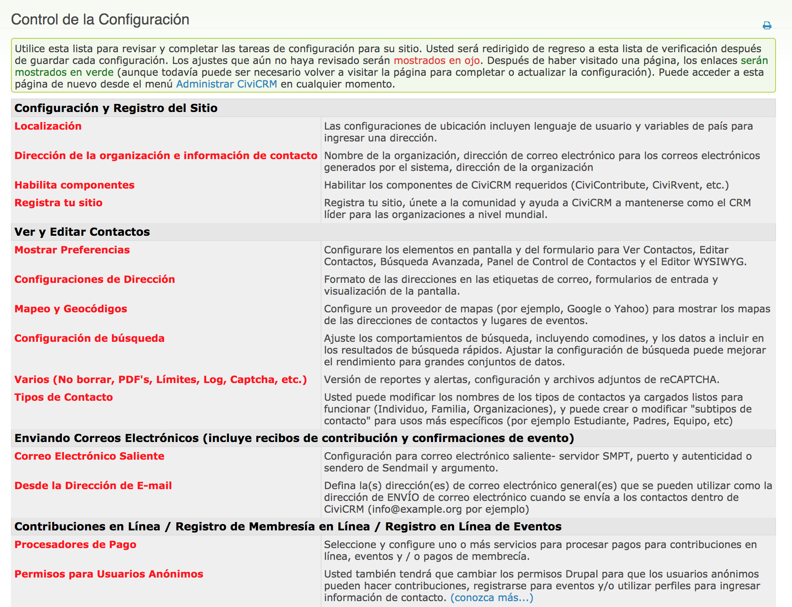

Instalación y configuración básica
==================================

Antes de seguir leyendo, por favor tenga en cuenta de que gran parte de la información aquí contenida está destinada a técnicos y puede ser difícil de entender si usted tiene poca o ninguna experiencia en la creación de aplicaciones web. Si usted no entiende este tema, quizás desee solicitar ayuda o dirigirse al personal técnico de su organización.

Requisitos previos
------------------

Antes de plantearse la instalación de CiviCRM, asegúrese de haber leído el capítulo 'hosting' para confirmar si su servidor puede o no admitirlo.

CiviCRM debe instalarse en un equipo que ha sido configurado con un servidor web (como Apache o Nginx), PHP y MySQL. Algunas personas prefieren probar CiviCRM en su propio ordenador local antes de instalarlo en un servidor web dedicado. Si usted está haciendo esto y no tiene los requisitos previos mencionados, puede descargar paquetes de Internet como WAMP, XAMPP, MAMPP y LAMP, que instalarán rápidamente un servidor web Apache, PHP y MySQL. (Los dos primeros paquetes son para Windows y los segundos dos son para Macintosh y Linux, respectivamente).

Antes de que pueda comenzar la instalación, debe decidir qué sistema de gestión de contenido (CMS) se utilizará para crear y gestionar los sitios web que desee integrar, eligiendo entre las opciones de código abierto: Drupal, Wordpress o Joomla!.

Puede encontrar instrucciones completas sobre cómo instalar CiviCRM aquí:
https://docs.civicrm.org/sysadmin/en/latest/index.html

Internet vs. instalaciones locales
----------------------------------

La mayoría de las organizaciones acceden a CiviCRM a través de Internet. Sin embargo, algunas organizaciones sólo quieren que el personal interno tenga acceso a CiviCRM y eligen instalar CiviCRM en una red interna y tenerlo sólo accesible internamente. La desventaja de una instalación interna es que no está disponible públicamente para que los contactos puedan actualizar sus datos o acceder a formularios para ser completados.

Actualizaciones
---------------

Las nuevas versiones de CiviCRM son liberadas aproximadamente dos veces al año (una vez en primavera y la otra en otoño). Usted tendrá que aplicar actualizaciones a su sitio CiviCRM periódicamente si desea aprovechar las nuevas características y mejoras, y también para mantener su sitio seguro. Algunas actualizaciones contienen correcciones de seguridad y es fundamental que se apliquen de manera oportuna. Es importante que pueda planificar los recursos (personas y tiempo) necesarios para aplicar actualizaciones a su sitio. Es recomendable aplicar las actualizaciones en un sitio de pruebas antes que el sitio en producción para asegurarse de que el proceso se ejecute sin problemas. También es fundamental realizar copias de seguridad de su sitio y su base de datos antes de ejecutar una actualización en su entorno de producción incluso si usted ha probado el proceso en un sitio de prueba.

Dado que las aplicar las actualizaciones es un proceso importante muchas organizaciones contratan los servicios de un proveedor de servicios experto en CiviCRM para llevarlas a cabo.

Configuración
-------------

Una vez instalado CiviCRM, debe revisar las tareas de configuración iniciales que le permiten personalizar CiviCRM para su organización.

Inicie sesión en su sitio CiviCRM y vaya a **Administrar > Consola de Administración > Lista de verificación de configuración**. En esta sección se describen las tareas generales, mientras que la configuración de cada componente será incluida en cada sección específica.

Utilice esta lista para revisar y completar las tareas de configuración para su sitio. Usted será redirigido de regreso a esta lista de verificación después de guardar cada configuración. Los ajustes que aún no haya revisado serán mostrados en rojo. Después de haber visitado una página, los enlaces seŕan mostrados en verde (aunque todavía puede ser necesario volver a visitar la página para completar o actualizar la configuración).

### Localización

La localización implica la adaptación de CiviCRM para su uso en un país o idioma específico mediante la traducción del texto que se muestra en la pantalla y el establecimiento de formatos específicos de región para las fechas y el dinero (incluyendo moneda). De forma predeterminada, CiviCRM está localizado para los Estados Unidos. Si usted está utilizando CiviCRM en un país diferente, necesita almacenar direcciones de contacto que aparezcan en países que no sean los Estados Unidos, o desea utilizar CiviCRM en otro idioma, deberá revisar y actualizar los valores en esta pantalla.

CiviCRM  ha sido traducido a varios idiomas y las traducciones están disponibles para descargar cuando se descarga CiviCRM. Estas traducciones son aportadas por miembros de la comunidad. Si CiviCRM no está disponible en su idioma, tal vez desee considerar traducirlo. Puede encontrar una guía de traducción en la wiki.

También es posible configurar su sitio para que admita varios idiomas. En este modo, los usuarios podrán elegir de una lista de idiomas disponibles después de iniciar sesión. También puede crear y guardar varias versiones multi-idioma de texto.

Para obtener más información, eche un vistazo aquí:
http://wiki.civicrm.org/confluence/pages/viewpage.action?pageId=88408149

### Dirección de la organización e información de contacto

Utilice esta pantalla para introducir la información que identifica la organización o entidad que es propietaria de esta instalación de CiviCRM. El nombre y la dirección de la organización se utilizan para identificar su organización en los envíos de CiviMail.

Además deberá introducir una dirección de correo electrónico válida perteneciente a su organización. Esta dirección se utilizará como el remitente de los correos electrónicos generados por el sistema.

### Habilitar componentes

Aquí es donde se pueden activar o desactivar los componentes de CiviCRM.

Cuando instala por primera vez CiviCRM los componentes más utilizados (CiviContribute, CiviEvent, CiviMail, CiviMember, CiviReport y CiviPledge) ya están habilitados. Si no necesita esos componentes, puede desactivarlos. También puede habilitar otros componentes como CiviCampaign, CiviCase y CiviGrant. Puede volver a visitar esta página en cualquier momento para habilitar más componentes.

También puede desactivar un componente que ya ha utilizado. La información del componente se conserva y seguirá estando allí si la vuelve a habilitar. Sería inusual desactivar un componente que ya han utilizado. Si desea simplificar el menú de administración y la página de búsqueda avanzada, en lugar de deshabilitar componentes puede utilizar permisos específicos (consulte el capítulo Permisos y control de acceso).

### Preferencias de visualización

Esta sección le permite modificar los elementos que se visualizan en las pantallas de CiviCRM a través de las siguientes configuraciones:

-   **Visualización de contactos**: controla las pestañas mostradas cuando se visualiza un registro de un contacto. Por ejemplo: Si su organización no realiza un seguimiento de las relaciones, desmarque esta opción para simplificar la visualización. Las pestañas de contribuciones, compromisos, membresías, eventos, contribuciones y casos se ocultan automáticamente si el componente correspondiente no está habilitado.

-   **Visualización de grupos inteligentes**: controla forma en que se visualizan los grupos inteligentes a los que pertenece un contacto. La opción "Mostrar a pedido" es la que suele dar el mejor resultado y es recomendable para la mayoría de sitios.

-   **Editando contactos**: controla los campos y las secciones que se muestran al crear o editar un contacto. Por ejemplo: Si su organización no registra el sexo y la fecha de nacimiento para las personas, entonces simplifique el formulario desactivando la Demografía.

-   **Buscar contactos**: controla las secciones incluidas en el formulario búsqueda avanzada. Por ejemplo: Si no utiliza las relaciones puede simplificar el formulario desactivando esta opción.

-   **Panel de contactos**: permite a sus contactos ver los grupos que se suscriben, el historial de las contribuciones, información de registro de eventos entre otra información. Puede controlar las secciones que deben incluirse en el panel de control. EJEMPLO: Si no desea que los contactos vean su propio historial de contribuciones, desactive esa opción.

-   **Editor WYSIWYG**: seleccione la opción CKEditor para proporcionar a los usuarios una forma fácil de introducir texto en los campos que permiten el formato HTML (como la introducción de las páginas de contribución en línea). Puede configurar CKEditor (consulte http://ckeditor.com/) para agregar o quitar funciones. Seleccione Textarea si no desea disponer de un editor enriquecido (WYSIWYG).

-   **Habilitar ventanas pop-up**: esta opción está activada de forma predeterminada y permite abrir ventanas emergentes (pop-up) en algunas pantallas del sistema. Desactive esta opción para volver a abrir los formularios a pantalla completa.

-   **Visualización del nombre para individuos**: muestra el formato de visualización para mostrar nombres de contactos de tipo individuo.

-   **Formato para ordenar los contactos por el nombre**: Formato que utilizará el sistema para ordenar los resultados de una búsqueda de los contactos individuales.

### Configuraciones de Direcciones

Accediendo a **Localización > Configuración de direcciones**, puede modificar los campos que se muestran por defecto para agregar y editar información de direcciones de contactos y de  eventos. También puede cambiar la distribución del campo de direcciones que se visualiza en pantalla y las etiquetas de correo. Puede controlar los valores predeterminados agregando un nuevo contacto y revisando los campos de dirección. Guarde el contacto y apunte el orden en el que se muestran los campos en la pantalla resumen del contacto. Si planea generar etiquetas de correo para los contactos, revise el diseño de la etiqueta (seleccione "Etiquetas de correo - Imprimir" en el menú desplegable después de realizar una búsqueda con la opción de menú **Buscar > Buscar contactos**).

Después de revisar los campos y diseños predeterminados, vuelva a la pantalla de **Configuración de direcciones** y realice los cambios necesarios.

-   **Etiquetas de correo** - Controla el formato de las etiquetas de correo. El formato predeterminado es:

*{Contact.addressee}
{contact.street_address}
{contact.supplemental_address_1}
{contact.supplemental_address_2}
{contact.city} {,} {contacto.state_province} {} {contact.postal_code}
{contact.country}*

Debe utilizar el token {contact.addressee} para incluir el nombre del destinatario en sus etiquetas. Es posible seleccionar entre una variedad de tipos de etiquetas según el código del fabricante cuando se generen las etiquetas para una lista de contactos. Es recomendable probar el tipo de etiqueta en la impresora que planea utilizar para verificar que esté todo correcto.

-   **Mostrar dirección** - controla el diseño de las direcciones de contacto y de ubicación de eventos que aparecen en las pantallas de CiviCRM. El formato predeterminado es:

*{Contact.address_name}
{contact.street_address}
{contact.supplemental_address_1}
{contact.supplemental_address_2} 
{contact.city} {,} {contacto.state_province} {} {contact.postal_code} 
{contact.country}*

Este formato también se aplica a las ubicaciones de los eventos- El token *{contact.address_name}* puede ser particularmente útil para eventos en los que es necesario incluir un nombre de la ubicación (por ejemplo "Feria de Muestras").

-   **Edición de dirección** - Modifique aquí los campos de dirección disponibles al editar un contacto. Puede ocultar campos que no planea utilizar para simplificar los formularios. EJEMPLO: Si no planea grabar latitud y longitud de los contactos, puede anular la selección de esos campos.

-   **Estandarización de la dirección** - CiviCRM incluye un plugin opcional para la conexión con el servicio Web de Normalización de Direcciones del Servicio Postal de Estados Unidos (USPS).

### Mapeo y Geocodificación

CiviCRM incluye soporte para los servicios de cartografía de Google y OpenStreetMap. La configuración de este servicio se encuentra en **Administrar > Opciones del Sistema > Cartografía y Geocodificación**. Estos servicios permiten a los usuarios mostrar direcciones de contacto y ubicaciones de eventos en un mapa. Para habilitar esta función, seleccione su proveedor de mapas y obtenga una clave para su sitio.

También puede seleccionar un proveedor de geocodificación. Este proveedor puede ser el mismo que para el mapeo o uno distinto. Una vez que este servicio esté habilitado, los registros de contactos y eventos se geocodificarán automáticamente (se insertará la latitud y longitud para esa dirección) a medida que añada o edite datos de dirección.

### Preferencias de búsqueda

Puede acceder a esta sección a través de **Administrar > Pantallas y datos personalizados > Preferencias de búsqueda**. Estas configuraciones permiten ajustar los comportamientos de la búsqueda, como el uso de comodines o los datos que se van a incluir en los resultados de una búsqueda rápida. Estos ajustes pueden mejorar el rendimiento en las instalaciones con grandes volúmenes de datos.

Un comodín es un carácter especial que se puede utilizar para sustituir a cualquier otro carácter en las búsquedas. CiviCRM le permite usar el carácter de porcentaje "%" para sustituir a uno o más caracteres, y el carácter de guión bajo "_"_ para sustituir a un carácter individual. Los comodines son útiles para ampliar los resultados de búsqueda.

Por ejemplo, si escribe "Voluntario%" como asunto de en la búsqueda de una actividad, coincidirá con cualquier actividad cuyo asunto comience con "Voluntario" (por ejemplo, "Voluntario para Casa Abierta" o "Oportunidades de Voluntarios").

-   **Comodines automáticos** - De forma predeterminada, cuando los usuarios buscan contactos por su nombre, la búsqueda trata el texto como si estuviera rodeado de signos de porcentaje. Por ejemplo si hace una búsqueda por 'ada' el sistema devolverá cualquier contacto cuyo nombre incluya esas letras 'Adams, Janet', 'Nadal, Jorge', etc. La desactivación de esta función acelerará significativamente las búsquedas de grandes bases de datos, Caracteres ("%" o "_"_) para buscar nombres parciales.

-   **Incluir eMail** - De forma predeterminada, cuando los usuarios buscan contactos por nombre, la interfaz de búsqueda también busca ese texto en las direcciones de correo electrónico. La desactivación de esta función acelerará las búsquedas de forma significativa para las grandes bases de datos, pero los usuarios tendrán que utilizar los campos de búsqueda de correo electrónico (desde Búsqueda Avanzada, Constructor de búsqueda o perfiles) para buscar contactos a través de su correo electrónico.

-   **Incluir Alias** - De forma predeterminada, los apodos o alias no se incluyen automáticamente cuando los usuarios buscan por Nombre. Cambie este valor a "Sí"" si desea que se incluyan.

-   **Incluir Paginador Alfabético** - Si está desactivado, el localizador alfabético no se mostrará en las pantallas de búsqueda. Esto mejorará el tiempo de respuesta de los resultados de la búsqueda en grandes base de datos.

-   **Incluir Orden por Cláusula** - Si está desactivado, los resultados de búsqueda no estarán ordenados. Esto mejorará significativamente el tiempo de respuesta en la búsqueda de resultados en grandes bases de datos.

-   **Perfil Predeterminado de Búsquedas de Contacto** – Usted puede seleccionar un perfil para sustituir las columnas que aparecen de forma predeterminada en la búsqueda de contactos.

-   **Tiempo de espera de caché del grupo inteligente** - Los grupos inteligentes son básicamente búsquedas guardadas. La lista de contactos de cada grupo inteligente se almacena en caché en la base de datos para evitar ejecutar la búsqueda guardada cada vez que accede a un grupo inteligente. Este campo determina el número de minutos para mantener la memoria caché antes de actualizarla. El valor predeterminado de 0 significa que el caché se vacía inmediatamente cuando se edita cualquier contacto o se agrega uno nuevo. Si sus datos de contacto cambian con frecuencia, puede intentar establecer esto con un valor de 5 minutos (o incluso más) para reducir la carga de procesamiento en su servidor. El inconveniente de retrasar la actualización de la memoria caché, es que los datos antiguos se seguirán viendo a los usuarios durante unos minutos después de actualizar con los nuevos datos.

-   **Autocompletar búsqueda de contacto** - Los campos seleccionados serán los que se muestren en la lista que se despliega en la búsqueda rápida que está a la izquierda del menú de navegación. El nombre del contacto está siempre incluido.

-   **Opciones de referencia de contacto** - Los campos seleccionados se mostrarán en los resultados que se despliegan en una búsqueda de autocompletado para campos personalizados del tipo "Referencia de contacto". El nombre del contacto siempre se incluye. Nota: Se debe asignar el permiso de "acceder a los campos de referencia de contacto" al rol anónimo si usted desea utilizar los campos personalizados de referencia de contacto en los perfiles de las páginas públicas. Para la mayoría de las situaciones, debe utilizar la opción "Limitar lista a Grupo" en la configuración un campo de referencia de contacto para evitar exponer toda la lista de contactos.

-   **Autocomplete Results** - especifica el número máximo de contactos que se mostrarán al momento de realizar una búsqueda un campo autocompletable. El valor predeterminado es 10.

-   **InnoDB Full Text Search** - si está utilizando MySQL 5.6+, puede habilitar las optimizaciones de búsqueda de texto completo de InnoDB.

### Varios (No borrar, PDFs, Límites, Log, CAPTCHA, etc.)

Utilice la pantalla Ajustes varios **Administrar > Opciones del Sistema > VArios** para configurar y controlar los siguientes comportamientos:

-   **Tiempo de espera de caché del Panel de control** - el número de minutos para actualizar el contenido del panel de control.

-   **Vigencia del Checksum** - El número de días antes de que expire un enlace personalizado que incluye el *checksum*. El checksum es un código seguro que asigna CiviCRM que se puede incluir en un link dentro de un mailing para que un contacto pueda acceder a sus datos (y a otra funcionalidad de CiivCRM) sin la necesidad de tener un usuario y contraseña.

-   **Papelera de contactos y no borrado** - Si está activado, los contactos eliminados se moverán a la papelera (en lugar de destruirse). Los usuarios con el permiso adecuado podrán buscar los contactos eliminados y restaurarlos (o borrarlos permanentemente).

-   **Logging (Registro)**: si está activada, se grabarán todas las acciones realizadas y serán almacenadas con sus cambios (en las respectivas tablas de log). De forma predeterminada, estas tablas se crearán en la misma base de datos. Sin embargo, puede configurar CiviCRM para escribir tablas de registro en una base de datos diferente mediante la edición del archivo civicrm.settings.php y especifique la base de datos de registro independiente en la configuración CIVICRM_LOGGING_DSN. Después de activar esta función, puede revisar los cambios en los registros de contactos mediante el informe de registro de contactos. Vaya a Informes > Informe de contactos (resumen).

-   **Adjuntar copia de PDF a recibos** - Si está activada, CiviCRM envía un recibo en PDF como archivo adjunto en un email para la suscripción de eventos o donativos en línea.

-   **Ruta de wkhtmltopdf** - wkhtmltopdf es una aplicación alternativa para generar PDF que puede proporcionar un mejor rendimiento, especialmente si está generando un gran número de cartas en PDF o recibos. El administrador del sistema tendrá que descargar e instalar esta aplicación, e ingresar la ruta de acceso a la misma.

-   **Alertas de nueva versión** - Se mostrarán  alertas a los usuarios con permisos "Adminisrar CiviCRM" cuando esté disponible una nueva versión de CiviCRM. Esta configuración sólo funcionará si la configuración "Comprobación de versiones y estadísticas" está habilitada.

-   **Comprobación de versiones y estadísticas** - esta función comprueba automáticamente la disponibilidad de una nueva versión estable de CiviCRM. Las alertas de la nueva versión se muestran en la página principal de Administración de CiviCRM. Las estadísticas sobre su instalación CiviCRM también se informan anónimamente al equipo CiviCRM para ayudar a priorizar los esfuerzos de los desarrollos en curso. Se recopila la siguiente información: versión de CiviCRM, versiones de PHP, MySQL y framework (Drupal / Joomla / Wordpress), y lenguaje por defecto. También se informan cantidades de registros (pero no datos reales). Puede establecer este campo en “No”, si no se siente cómodo al enviar esta información.

-   **Mostrar "Funciona con CiviCRM"** - Cuando está habilitado, se muestra "Funciona con CiviCRM" en la parte inferior de los formularios públicos. Esto ayudará a divulgar el proyecto de CiviCRM.

-   **Número máximo de archivos adjuntos**  - puede aumentar o disminuir el número máximo de archivos (documentos, imágenes, etc.) que se pueden adjuntar a correos electrónicos o actividades. El valor predeterminado es 3.

-   **Tamaño máximo del archivo (en MB)** - tamaño máximo de un archivo (documentos, imágenes, etc.) que se puede adjuntar a correos electrónicos o actividades. Tenga en cuenta que sus archivos de configuración PHP, php.ini, deben soportar al menos un tamaño de archivo tan grande como el valor especificado aquí.

-   **Permitir permisos de relación de segundo grado** - si está activado, los contactos con los permisos para editar un contacto relacionado heredarán los permisos de ese contacto para editar otros contactos relacionados. Esto se puede usar, por ejemplo, para permitir que el profesor de una clase edite los registros para los estudiantes de esa clase cuando ambos están vinculados a la clase (configurada como un subtipo de organización) a través de relaciones.

-   **Claves de ReCAPTCHA** - reCAPTCHA es un servicio gratuito que ayuda a prevenir el abuso automatizado de su sitio, requiriendo a los usuarios leer un par de palabras al azar y escribirlas en el formulario. Para utilizar reCAPTCHA en los formularios CiviCRM  públicos, regístrese en el sitio de reCaptcha de Google e ingrese los datos públicos y privados proporcionados

### Tipos de contactos

Puede modificar los nombres de los tipos de contacto incorporados (Individual, Familia, Organización), crear y modificar "subtipos de contacto" para usos más específicos (por ejemplo, Estudiante, Padre, Equipo, etc.). Puede acceder a esta página en **Administrar > Pantallas y datos personalizados > Tipos de contacto**.

### Correo Electrónico Saliente

Si está enviando correos electrónicos a los contactos mediante CiviCRM, debe configurarlo para que pueda conectarse a su servidor de correo. Tales correos electrónicos incluyen el envío de recibos a los contribuyentes, el envío de confirmaciones a las personas que se registran para eventos y el uso de CiviMail para enviar correos masivos.
CiviCRM admite tres métodos diferentes de conexión a un servidor de correo: correo (la función de correo PHP integrada); SMTP (protocolo de transporte de correo simple) y Sendmail. Cada método requiere que ingrese configuraciones específicas. Si no está familiarizado con estos términos, o si no está seguro de los valores correctos, consulte al administrador del sistema, al ISP o al proveedor de alojamiento.
Siempre debe enviar un correo electrónico de prueba después de introducir o modificar la configuración. Simplemente haga clic en "Guardar y enviar correo electrónico de prueba" (se muestra en la siguiente captura de pantalla). Se enviará un correo electrónico a la dirección de correo electrónico asociada a su cuenta de inicio de sesión de usuario. La dirección de correo electrónico De será la dirección predeterminada De que configuró en la sección anterior.

Si CiviCRM no puede enviar el correo electrónico de prueba, verá un mensaje en la pantalla con el error específico y algunas sugerencias para solucionar el problema.

### Inhabilitación del correo electrónico saliente

Si no desea que los usuarios envíen correos electrónicos salientes desde CiviCRM, seleccione
-   **Desactivar correo saliente** - Sin embargo, si deshabilita el correo electrónico saliente y está utilizando las páginas de contribución en línea o el registro de eventos en línea, tendrá que desactivar las funciones de confirmación automática de recibos y registros (activadas de forma predeterminada). De lo contrario, sus contactos verán mensajes de error después de haber completado una contribución o registrado a un evento.
-   **Redireccionar la base de datos** - si se selecciona esta opción, todos los correos electrónicos se registrarán como envíos archivados en lugar de enviarse.

###Desde la Dirección de E-mail

CiviCRM utiliza la dirección de correo electrónico principal del usuario como la dirección para enviar correos electrónicos a los contactos. Sin embargo, puede utilizar esta página para definir una o más direcciones de correo electrónico que puede ser seleccionada alternativamente. EJEMPLO: “Servicio al Cliente” <clientservices@example.org>

### Procesadores de pago

Los procesadores de pagos son empresas que manejan transacciones con tarjetas de crédito para comercios y organizaciones sin fines de lucro y luego transfieren fondos a la cuenta bancaria de la organización. Si planea usar CiviCRM para aceptar contribuciones en línea, inscripción y renovación de membresías en línea o registro de eventos en línea, tendrá que seleccionar y configurar un procesador de pagos para su sitio.
CiviCRM soporta varios procesadores diferentes y proporciona una forma para que los desarrolladores integren procesadores adicionales basados en las necesidades de sus clientes. Cada procesador tiene su propia estructura de precios y características. Consulte la sección "Contribuciones" de esta guía para obtener una lista de factores a tener en cuenta al seleccionar un procesador.
Los pasos reales implicados en configurar y probar su conexión del procesador del pago son diferentes para cada procesador. Para obtener más información, visite:
http://wiki.civicrm.org/confluence/display/CRMDOC/Payment+Processors

### Permisos para Usuarios Anónimos

Este enlace está presente en los sitios de Drupal, Joomla y WordPress. Los permisos de sitios para anónimos y otros usuarios se establecen después de navegar en **Administrar > Usuarios y Permisos > Control de acceso**. Consulte el capítulo Permisos y control de acceso en esta sección para obtener información sobre cómo configurar permisos.

### Plantillas del Sistema

Las plantillas que utiliza el sistema, se utilizan para generar los correos enviados a contactos como los recibos de contribución, las confirmaciones de eventos y muchos otros flujos de trabajo. Usted puede personalizar el estilo y la redacción de estos mensajes.
Los mensajes de flujo de trabajo incluyen el texto y la lógica del programa necesaria. Tenga cuidado al editar para no modificar la lógica del programa. Asegúrese de probar el flujo de trabajo y revisar los correos electrónicos enviados después de hacer cualquier cambio. Si usted encuentra que los cambios han causado problemas, errores o falta de información - siempre se puede "Volver" a la configuración predeterminada para ese flujo de trabajo.
Si su organización ha modificado las versiones predeterminadas de las plantillas del flujo de trabajo del sistema, entonces los cambios y correcciones que se incluyeron requerirán una actualización para que se unan las versiones modificadas..
