Contactos
=========

Este capítulo trata sobre los contactos: el bloque básico de construcción de
CiviCRM. Veremos cómo encontrar, ver, agregar, editar y eliminar contactos.
También buscaremos formas de ampliar y personalizar contactos, y de cambiar la
forma en que los contactos aparecen en el interfaz de usuario.

Por defecto, CiviCRM viene con tres tipos de contacto:

-   **Individuos** - p.ej. personas

-   **Organizacione**s - por ejemplo empresas u otras organizaciones sin ánimo
    de lucro.

-   **Familias** - normalmente familias o grupos que comparten la misma
    ubicación.

Cada registro de contacto viene con un conjunto de campos básicos, incluyendo:

-   nombres (nombre y apellido, etc. para individuos y el nombre de la
    organización, etc, para organizaciones)

-   campos de saludo y destinatario para diferentes métodos de comunicación

-   métodos de contacto, e.ej. direcciones de correo electrónico, números de
    teléfono, direcciones de sitios web, etc.

-   direcciones (es decir, ubicaciones físicas)

-   preferencias de comunicación: es decir, los métodos con los que prefieren
    ser contactados, y aquellos con los que no desean ser contactados

Puede definir nuevos **subtipos de contacto** basados en los tipos de contactos
que vienen por defecto. Puede agregar campos personalizados que se apliquen a
todos los contactos. También puede agregar campos personalizados que se apliquen
a ciertos tipos o subtipos de contacto.

Piense en los contactos como el centro de su universo CiviCRM. Todos los demás
componentes básicos de CiviCRM, al igual que las relaciones, las actividades,
los grupos y las contribuciones, se conectan de alguna manera con los contactos.

Un vistazo a los contactos
--------------------------

Los contactos vienen organizados en pestañas. La primera pestaña con la que se
encuentra al ver un contacto es la **pestaña de resumen** que incluye la
información básica sobre su contacto. Después de la pestaña de resumen hay una
serie de pestañas que muestran información sobre diferentes aspectos del
contacto. Organizar el contacto en pestañas ayuda a administrar la gran cantidad
de datos que se pueden recopilar sobre los contactos a lo largo del tiempo.

Las pestañas se activan y desactivan dependiendo de qué componentes están
habilitados y qué permisos tenga. Por ejemplo, solo verá la pestaña de
membresías si el componente CiviMember está activado y tiene permiso para ver
membresías, etc. También puede definir pestañas adicionales que muestren datos
personalizados adicionales que desee recopilar sobre sus contactos.

### Acciones de Contacto

Encima de la línea de pestañas, verá algunos botones. El primer botón es el
botón **Acciones**, que es un atajo útil para realizar acciones con este
contacto. Por ejemplo, puede agregar una nota a este contacto o registrar una
nueva contribución, reunión u otra actividad.

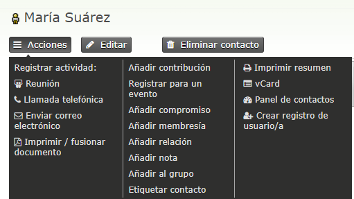

### Pestaña Resumen

La pestaña de resumen muestra información general sobre su contacto. Aquí
encontrará nombres, direcciones y detalles de contacto, así como detalles de los
métodos de comunicación.

Algunos campos en esta pestaña son solo para personas, por ejemplo, nombre,
apellido, alias, etc. Otros campos son solo para organizaciones, por ejemplo,
nombre de la organización.

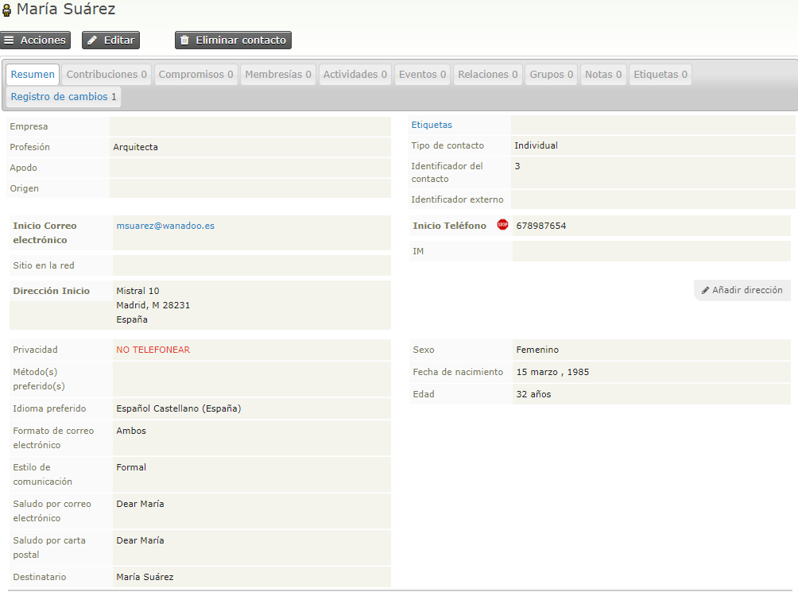

#### Campos de Individuos

Los nombres de las personas se dividen en las siguientes partes: prefijo,
nombre, segundo nombre, apellido, sufijo y apodo (no es necesario usarlos
todos). Los prefijos y sufijos se seleccionan de una lista desplegable. Si no
puede encontrar el valor que desea, puede agregar más opciones a la lista desde
la siguiente pantalla: **Administrar CiviCRM > Personalizar campos y
pantallas > Opciones desplegables > Prefijos individuos (Sra., Sr.
...)**

#### Direcciones

Puede registrar una o más direcciones para un contacto.  Cada dirección necesita
debe estar en un  **tipo de ubicación** diferente (por ejemplo, trabajo, hogar,
etc.). Una de las direcciones se puede marcar como principal y se usará para
cualquier correo postal que haga. Puede elegir explícitamente qué ubicación será
la principal para una persona en particular, o dejarla predeterminada para la
primera que ingrese.

Puede compartir direcciones entre contactos. Por ejemplo, puede que necesite
conservar información sobre contactos individuales y las organizaciones donde
trabajan. Al crear o editar la dirección de "trabajo" para un individuo, marque
la casilla "Compartir dirección con". Si su empleador ya existe en su base de
datos, puede seleccionarlos en el cuadro de búsqueda rápida que aparece. De lo
contrario, puede crear el registro de la organización del empleador sobre la
marcha seleccionando "Nueva organización" en el menú desplegable "Crear nuevo
contacto".

Si una persona le paga con tarjeta de crédito, los detalles utilizados para la
Dirección de facturación, en los pagos con tarjeta de crédito, se almacenarán en
la ubicación de Facturación del contacto.

Si tiene habilitado un proveedor de mapas, puede hacer clic en el ícono del mapa
al lado de una dirección para ver la ubicación de un contacto en un mapa.

#### Números de teléfono

Puede almacenar varios números de teléfono para cada contacto. Los números de
teléfono tienen ubicaciones (por ejemplo, trabajo, hogar, etc.) y tipos, por ej.
teléfono fijo, fax, móvil. Tenga en cuenta que los números de teléfono que
agregue a partir del tipo móvil estarán disponibles para enviar SMS.

#### Direcciones de Correo Electrónico

Puede almacenar múltiples direcciones de correo electrónico para cada contacto.
Una de estas direcciones de correo electrónico puede marcarse explícitamente
como la dirección que recibe todos los correos masivos, tales como boletines
electrónicos y anuncios (por ejemplo, estos son correos electrónicos que su
organización enviaría usando el componente CiviMail). Cualquier correo
electrónico que rebote se marca automáticamente como en espera cuando se envían
correos electrónicos a través de CiviMail. Vea la sección de Correo para más
información.

#### Preferenciasd de Comunicación y opciones de Privacidad

Se pueden definir las preferencias de comunicación (es decir, los canales de
comunicación preferidos por los contactos) y las opciones de privacidad (por
ejemplo, no contactarme por correo electrónico). Las opciones de privacidad se
respetan cuando se llevan a cabo ciertas funciones, p.ej. las etiquetas postales
no se imprimen para los contactos con la opción de privacidad "no enviar por
correo" y los correos electrónicos no se envían a los contactos con la opción de
privacidad "no enviar por correo electrónico".

Aquí podrá encontrar una breve explicación de cada opción de privacidad para los
registros de contactos en CiviCRM:

-   **No llamar por teléfono**- El usuario final ha decidido que no quiere ser
    contactado por teléfono.

-   **No enviar correos electrónicos**- El usuario final ha decidido que no
    quiere ser contactado via correo electrónico.

-   **No enviar correo**- El usuario final ha elegido no ser contactado via
    correo postal.

-   **No enviar SMS**- El usuario final ha elegido no ser contactado a través
    del servicio de mensajes de texto en su teléfono móvil.

-   **No comunicaciones comerciales**- El usuario final ha elegido no compartir
    su información con otras organizacioThe user has elected not to share their
    info with other organizations. (ie. you may not share or sell user's
    information to other parties)

-   ** NO ENVIAR CORREOS MASIVOS (El usuario no lo desea)** - Esta opción se
    marca cuando el usuario selecciona la opción de ¨Desinscribirse¨ al recibir
    un email desde CiviMail.

#### Campos de saludos y destinatario

Por defecto, los saludos y los campos del destinatario se calculan en función de
los campos de nombre de los contactos. Por ejemplo, el saludo postal para una
persona llamada 'Jenny Soper' es 'Querida Jenny'.

Los saludos predeterminados se pueden configurar a nivel global aquí:
**Administrar CiviCRM > Comunicaciones > Formatos de saludo por correo
electrónico o Formatos de saludo por correo postal o formatos para
destinatarios.**

También se pueden seleccionar diferentes formatos para cada contacto y también
se pueden personalizar contacto por contacto.

### Pestaña de Relaciones

Las relaciones son conexiones entre registros de contacto de su base de datos.
Cada conexión se puede nombrar para describir la naturaleza de la conexión, y un
contacto puede tener muchas relaciones con otros contactos en la base de datos.
En el siguiente ejemplo, puede ver una lista de relaciones actuales y una lista
de relaciones inactivas.

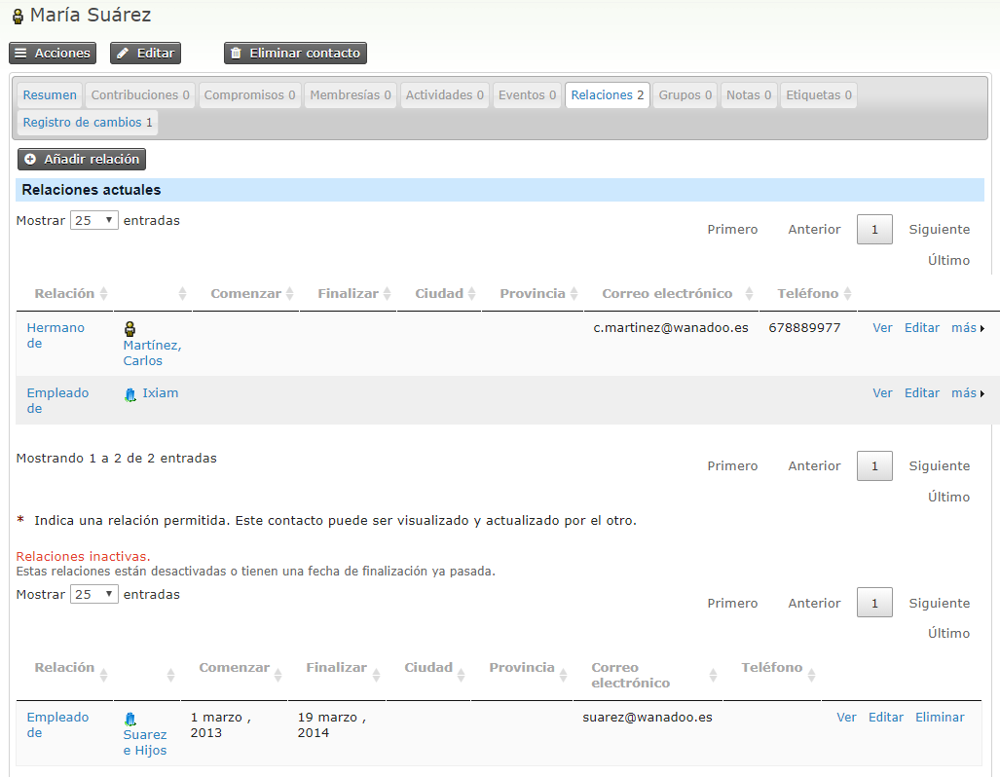

Puede leer más sobre cuándo tiene sentido usar relaciones en el capítulo
**Relaciones**  de la sección **organizar sus datos**.

### Pestaña de Actividades

La pestaña Actividades muestra una lista de todas sus interacciones con un
contacto, incluidas todas las actividades integradas de CiviCRM, como asistencia
a eventos, contribuciones, llamadas telefónicas, etc., así como cualquier
actividad personalizada que pueda haber agregado. También le permite registrar
actividades con contactos. Al hacer clic en los íconos en la parte superior de
la pantalla (Enviar un correo electrónico, una reunión, una llamada telefónica)
aparecerá una pantalla donde puede ingresar esos detalles. Esta pestaña también
mostrará las actividades personalizadas que haya definido.

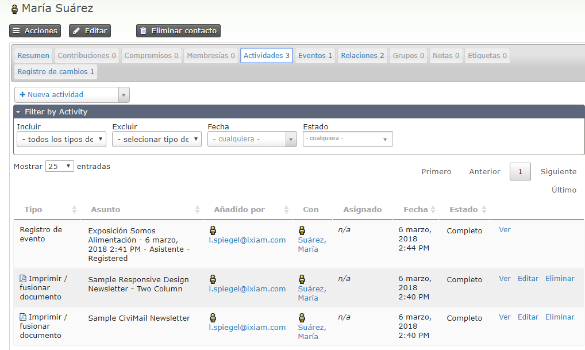

Para obtener más información sobre actividades, consulte la sección Actividades
en este capítulo.

### Pestaña de Mailing

Esto solo es visible si ha desmarcado la opción **Habilitar CiviMail para crear
actividades en entrega**  en  **Administer > CiviMail > Configuración de
los componentes CiviMail**. En ese caso, cada correo electrónico masivo se
registra en la pestaña de envíos en lugar de en la pestaña de actividades. Esto
mejora la velocidad a la que se carga la pestaña de actividades si su
organización envía correos electrónicos masivos a grandes listas de
distribución.

### Pestaña de Contribuciones

La pestaña Contribuciones muestra las contribuciones financieras realizadas por
un contacto, así como un resumen de la actividad de contribución del contacto
(cantidad total de contribuciones en el tiempo, cantidad total de contribuciones
y cantidad promedio de contribuciones).

La pestaña Contribuciones también le permite registrar contribuciones fuera de
línea usando el botón Registrar contribución, o registrar una transacción de
tarjeta de crédito en nombre del contacto (útil si la contribución se ha
realizado por teléfono) usando el botón Enviar contribución de tarjeta de
crédito. Ambos botones conducen a formularios que le permiten seleccionar el
Tipo Financiero además de la información normal de una contribución recogida de
las páginas de contribución pública.

Read more about Contributions, in the Contributions chapter of this book.

### Pestaña de Membresía

Esta pestaña muestra las membresías que tiene un contacto. Desde esta pestaña,
puede agregar membresías y enviar pagos con tarjeta de crédito para membresías
que requieren una tarifa. También puede renovar o eliminar membresías desde el
enlace "más" relacionado con cada membresía de las membresías existentes del
contacto.

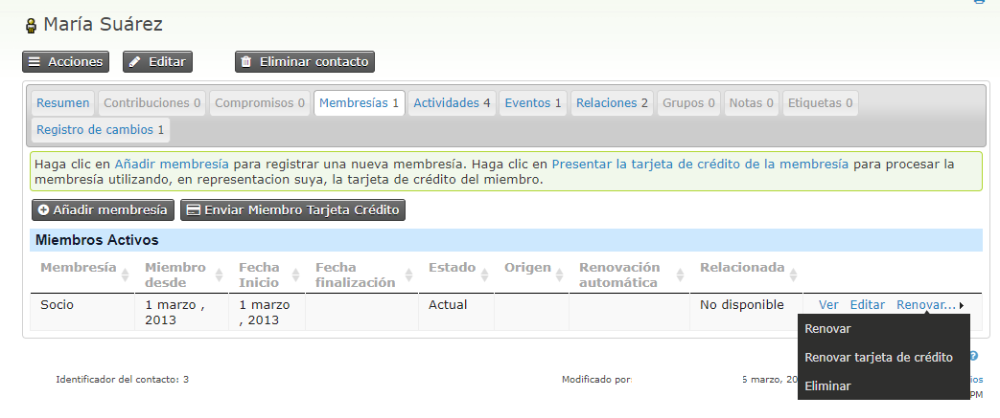

Lea más sobre Membresías en el capítulo de Membresía de la guía.

### Pestaña de Eventos

La pestaña Eventos muestra eventos relacionados con este contacto, por ejemplo,
eventos para los cuales el contacto se ha registrado, atendido o ofrecido como
voluntario.

Desde esta página, puede registrar al contacto para un evento y usar el botón
*Enviar registro de evento por tarjeta de crédito* si el evento requiere pago.
El pago relacionado aparecerá en la pestaña Contribuciones del contacto en la
primera fila.

También puede modificar la información del evento en relación con el contacto
haciendo clic en el enlace Editar. Por ejemplo, puede cambiar el estado del
evento del contacto de "registrado" a "atendido".

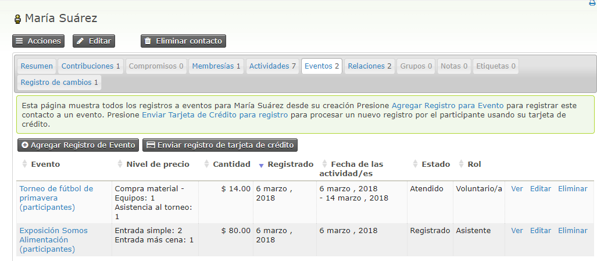

Lea más sobre Eventos en el capítulo de Eventos de esta guía.

### Pestaña de Grupos

La pestaña Grupos muestra los grupos a los que pertenece el contacto. Los grupos
se pueden usar de varias formas, incluidas las listas de distribución y los
permisos (**ACL**s).

Puede agregar y eliminar un contacto de los grupos, y ver un historial de grupos
de los cuales el contacto se ha desinscrito o del cual ha sido eliminado.

La columna Estado muestra quién ha agregado el contacto al grupo. La opción de
que los usuarios puedan agregarse a un grupo, es una de las configuraciones que
puede establecer al crear un grupo. Cuando configura la visibilidad de un grupo
como "Listado público", los usuarios pueden unirse a través de los formularios
de **Perfil**. Quizás quiera familiarizarse con la discusión sobre el uso de
perfiles para la inscripción en listas de correo de distribución tratado en una
sección posterior.

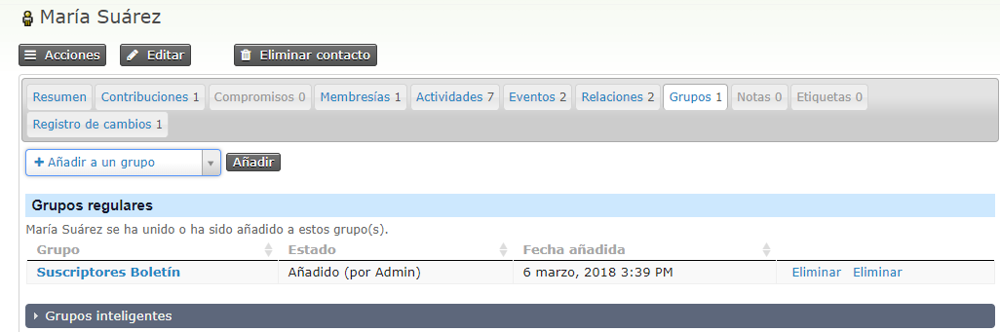

Para más información sobre este tema, consulte la sección de Etiquetas y Grupos
de la guía.

### Pestaña de Notas

La pestaña Notas es un lugar donde puede registrar partes aleatorios de
información sobre un contacto. En general, utilizaría campos personalizados para
la información que planea recopilar sobre sus contactos, pero en algunos casos
puede ser útil registrar notas ad-hoc adicionales. Como esta información no está
estructurada, debe tener cuidado con el uso de la pestaña Notas, a menos que
sepa que usted u otras personas que utilizan su implementación de CiviCRM
recordarán mirar esa pestaña. Al crear una nota, tanto el tema como el contenido
son campos de texto libre (es decir, el campo de asunto no tiene que elegirse
entre las opciones predefinidas).

Puede especificar la privacidad de "Solo autor" para una nota. Esto significa
que solo la persona que escribió la nota, o alguien con el permiso "ver todas
las notas" (a través de su CMS) puede verla o editarla.

### Pestaña Etiquetas[¶](https://docs.civicrm.org/user/en/latest/organising-your-data/contacts/#tags-tab)

Las etiquetas son una forma de categorizar contactos en su base de datos (otros
métodos son datos personalizados y grupos). Puede configurar qué etiquetas desea
usar para su organización. Puede buscar etiquetas y crear Grupos inteligentes
basados en ellas.

Las etiquetas junto a Palabras clave forman parte del conjunto de etiquetas de
Palabras clave. Un conjunto de etiquetas es una agrupación específica de
etiquetas que puede crear. Los conjuntos de etiquetas no son jerárquicos y puede
crear una nueva etiqueta en un conjunto de etiquetas simplemente escribiendo una
nueva etiqueta en el campo. Las etiquetas existentes que coincidan con lo que
escribe también aparecerán como una lista desde la que puede seleccionar.

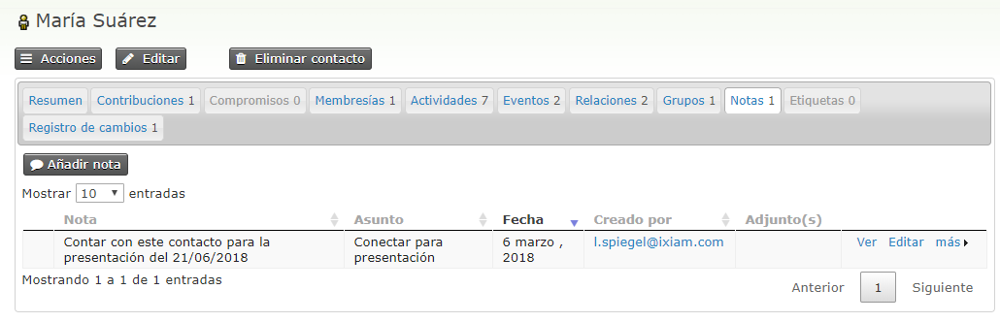

Para más información sobre este tema, consulte la sección Etiquetas y Grupos de
esta guía.

### Etiqueta de Registro de Cambios

Esta pestaña proporciona información limitada sobre los cambios realizados en un
registro de contacto. Muestra la fecha de cambio y quién hizo el cambio, pero no
lo que cambió.

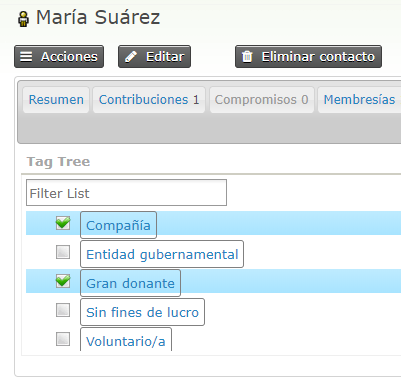

Nota: Los administradores pueden usar el Informe de registro de contactos para
obtener información detallada sobre los cambios en los registros de contacto
(quién, qué y cuándo).

Añadir contactos
----------------

La forma más sencilla de agregar un único contacto a CiviCRM es usar el menú de
navegación en la parte superior de cualquier página que no sea pública. Para
crear un nuevo individuo, vaya a: Contactos \> Nuevo individuo:

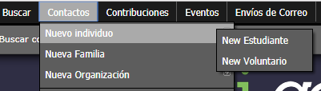

Todos los formularios de creación de contactos están organizados de manera
similar, con información básica (nombre, correo electrónico, etc.) en la parte
superior del formulario y campos más específicos agrupados por tipo o tema en
acordeones (como campos de dirección, preferencias de comunicación y cualquier
campo personalizado que haya agregado para el tipo de contacto).

Para todos los tipos de contacto, puede usar la opción **Comprobar contactos
coincidentes** para evitar la duplicación de entradas. Después de ingresar toda
la información que tiene en esta sección, puede hacer clic en **Buscar contactos
coincidentes**.

*Para agregar un registro individual a la base de datos, se requiere nombre y
apellido o dirección de correo electrónico. Para agregar un registro de
Organización o Familia a la base de datos, solo se requiere el nombre de
Organización / Familia. Puede completar tantos de estos campos como desee, y no
lo olvide, siempre puede regresar y realizar los cambios necesarios utilizando
la pantalla de edición.*

Cosas útiles que debes saber al agregar contactos:

Dirección: puede agregar varias direcciones a un registro de contacto. Esto le
permite almacenar las direcciones de domicilio y trabajo de alguien, así como
una dirección de facturación si fuera diferente.

Verá una casilla de verificación que le permite compartir la dirección de un
contacto existente o de un nuevo contacto que podrá crear. Si selecciona un
contacto nuevo, deberá seleccionar el tipo de contacto que desea crear y
aparecerá un cuadro emergente para agregar el nuevo registro de contacto. Cuando
una persona usa la dirección de otro contacto, esa dirección solo se puede
editar desde el registro del "contacto maestro".

Las opciones disponibles en el menú desplegable de países dependerán de las que
haya puesto a disposición en **Administrar > Localización > Idiomas, Moneda,
Ubicaciones**  en Países Disponibles.

Puede haber campos aquí que no necesita. Los campos de dirección disponibles se
pueden editar en **Administrar > Ubicación > Configuración de dirección**.  El
campo "Nombre de dirección" que se puede usar para etiquetar una dirección
particular (por ejemplo, "Casa de verano") está oculto por defecto, pero puede
ser habilitado desde esa pantalla.

Etiquetas y grupos: aquí puede especificar a qué etiquetas y grupos agregar su
contacto. Tenga en cuenta que solo puede agregar grupos y etiquetas existentes
con etiquetas existentes. Puede leer más sobre cómo crear etiquetas y grupos en
el capítulo Grupos y etiquetas de esta guía.

Una vez que haya completado el formulario, tiene la opción de tres botones en
los que hacer clic:

-   Guardar, guardará el registro de contacto y lo llevará a la pantalla del
    contacto.

-   Guardar y Nuevo guardará el contacto y despejará el formulario para que
    pueda agregar otro contacto

-   Cancelar, descartará la información registrada y le llevará a su panel de
    acceso CiviCRM.

Editar Contactos
------------------------------------------------------------------------------------------------------------

La edición de información en la pantalla de resumen es simple. Al pasar el
cursor por la esquina superior derecha del bloque que desea editar aparecerá el
enlace  **Editar información**. Puede editar la información directamente en la
pantalla de resumen.

Si necesita editar mucha información para un contacto en particular, una
alternativa es abrir todo el contacto para editar haciendo clic en el botón
Editar que está encima de las pestañas.

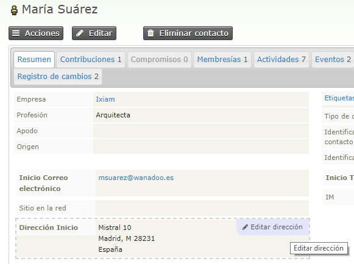 

Tenga en cuenta que en las raras ocasiones en que dos usuarios administradores
distintos editan un contacto al mismo tiempo (específicamente que ambos abren la
pantalla de edición, ambos guardan el contacto), el segundo usuario
administrador recibirá una notificación de la edición del primer administrador y
será dado la posibilidad de 'fusionar' manualmente las ediciones.

Eliminar Contactos
------------------

En la parte superior derecha, hay un botón para Eliminar el contacto. Cuando se
elimina un contacto, no desaparece por completo, sino que se mueve a la
papelera, donde se puede recuperar en una fecha posterior (utilizando la función
de búsqueda en la papelera de **búsqueda avanzada**). Consulte "búsqueda" en el
capítulo "Trabajar con sus datos" para obtener más información).

Los contactos eliminados se mueven a la "papelera" de forma predeterminada (y se
pueden restaurar más adelante si es necesario). Hay una variedad de formas de
eliminar un contacto:

- **Contacto único** : abra el contacto y haga clic en el botón "eliminar
contacto" en la parte superior de la página. Alternativamente, ejecute una
búsqueda del contacto y, desde la lista de resultados, mire hacia el final de la
fila del contacto, haga clic en "Más" y seleccione "Eliminar contacto".

- **Contactos múltiples**: realice una búsqueda avanzada, marque las casillas
de cada contacto que desee eliminar (o *seleccione todo*  en la casilla que
encontrará en la parte superior) y en el menú desplegable 'acciones', elija
'Eliminar contactos' para enviar los contactos a la papelera (si está
habilitada) o 'Eliminar permanentemente'. Se mostrará una página de advertencia
para verificar su intención; simplemente haga clic en 'Eliminar' para continuar
o 'Cancelar' para regresar a la pantalla anterior.

Subtipos de Contacto
--------------------

Además de los tres tipos de contacto predeterminados (individuos, familias y
contactos), puede definir tipos de contacto adicionales (a veces denominados
subtipos de contacto) para satisfacer las necesidades de su organización.

Cada subtipo de contacto que defina se basará en uno de los tres tipos de
contacto principales. Por ejemplo, 'Estudiante' se basaría en el tipo de
contacto 'Individual', y 'Granja' podría basarse en el tipo de contacto
'Organización', o quizás el tipo de contacto 'Familia', dependiendo de su caso
de uso.

Los tipos de contacto son muy útiles cuando necesita recopilar y mostrar
diferentes conjuntos de datos personalizados para diferentes tipos de contactos
(por ejemplo, puede recopilar información sobre el área temática y las
calificaciones de todos los profesores en su base de datos pero no está
interesado en recopilarlos para otros individuos. Para hacer esto, crearía un
tipo de contacto llamado Profesor, basado en el contacto Individual y luego
crearía un conjunto de datos personalizado que solo incluyera Individuos del
tipo Profesor (consulte datos personalizados para obtener más información).

Tenga en cuenta que los tipos de contacto principales son mutuamente
excluyentes, es decir, un contacto no puede ser una organización y un individuo.
Sin embargo, los contactos pueden ser de más de un subtipo de contacto definido
por el usuario, es decir, podrían ser un Profesor y un Padre, por ejemplo.

Para editar los tipos de contacto existentes y crear nuevos tipos de contacto,
vaya a **Administrar > Personalizar datos y pantallas > Tipos de contacto**.
Tenga en cuenta que no puede eliminar los tipos de contactos incorporados, pero
puede cambiar sus nombres y las imágenes asociadas a ellos.

Para agregar campos personalizados a subtipos de contacto específicos, consulte
el capítulo sobre campos personalizados.

Personalizar la vista de Contactos
----------------------------------

Después de trabajar con la edición de contactos y las pantallas de resumen por
un tiempo, podrá darse cuenta de que hay secciones y/o campos que no son útiles
para su organización. La buena noticia es que puede ocultar fácilmente algunos
campos y secciones. Por ejemplo, si su organización no necesita almacenar
información demográfica, puede eliminarla configurando las Preferencias del
sitio, a través de un usuario que tenga permisos de Administrador CiviCRM.

-   Vaya a: **Administrar > Personalizar datos y pantallas > Preferencias de
    visualización**.

-   Borre la casilla Datos demográficos en Editar contactos.

-   Haga clic en Guardar.

También puede usar esta pantalla para reorganizar el orden en que se muestra la
información.

Del mismo modo, si desea eliminar (o agregar) campos en la sección de la
dirección postal:

-   Vaya a: **Administrar > Localización > Configuración de dirección**.

-   Marque o desmarque los campos en Edición de direcciones.

-   Haga clic en Guardar.

Si cree que algunas de las pestañas no son útiles y no se usarán en su
implementación, puede desactivar o habilitar pestañas específicas de
**Administrar > Personalizar datos y pantallas \ Preferencias de
visualización**. Si no ve algunas de las pestañas que se describen a
continuación, es posible que deba habilitarlas. La visibilidad de algunas
pestañas depende de qué componentes estén habilitados en su instalación. Por
ejemplo, la pestaña Contribuciones se ocultará si el componente CiviContribute
está deshabilitado.
