Búsquedas
======

Este capítulo trata sobre las diferentes formas de encontrar información
registrada en CiviCRM. Dos de las técnicas utilizadas, *encontrar contactos* y
*flujos de trabajo de ¨búsqueda-acción¨*(descritos en la segunda viñeta), son
funciones fundamentales en CiviCRM, por lo que la mayoría, si no todos los
usuarios, encontrarán este capítulo útil.

Empezaremos por algunas búsquedas simples y luego pasaremos a técnicas más
avanzadas. Los principiantes en CiviCRM deberían estar familiarizados con la
Búsqueda Rápida, Búsqueda Avanzada y la Búsqueda de componentes. Los usuarios
más avanzados deberían conocer también las opciones de Informes, Búsquedas
Personalizadas y Constructor de Búsquedas.

Existen tres razones principales para buscar:

-   Encontrar un contacto específico: la casilla de Búsqueda Rápida puede
    encontrar contactos por su nombre, correo electrónico o una gran variedad
    características.

-   Para realizar una acción sobre un contacto o contactos que cumplen
    determinados requisitos: un flujo de trabajo común en CiviCRM, llamado
    ¨búsqueda-acción, es decir, encontrar contactos que cumplen con ciertos
    requisitos y posteriormente ejectuar una acción común sobre ellos. Por
    ejemplo, encontrar todos los contactos del grupo de asesores para invitarlos
    a una reunión, encontrar a todos los contactos cuyas membresías han expirado
    recientemente para enviarles un recordatorio de renovación, o encontrar
    todos los contactos por debajo de 25 años, en un lugar determinado, para
    enviarles un correo electrónico sobre un próximo evento.

-   Para realizar informes específicos ad-hoc.

Para realizar informes específicos, la opción de Buscar normalmente es muy útil
pero tiene sus limitaciones. Por ejemplo, puede agrupar resultados por criterios
particulares, realizar resúmenes, o crear gráficos de resultados, fácilmente.
Para más información sobre Informes Avanzados, consulte la sección *CiviReport*.

Búsqueda Rápida
---------------

La forma más fácil de encontrar un contacto determinado es usando la casilla de
*Búsqueda Rápida* que aparece en el menú de navegación en la parte superior
izquierda de la pantalla. Puede buscar por uno o varios criterios. Una vez que
haga clic en la casilla puede comenzar a teclear inmediatamente para usar la
búsqueda por defecto Nombre/Correo electrónico o puede hacer clic de nuevo para
que se muestren otros criterios de búsqueda en una lista de selección
desplegable. Los contactos que coincidan con la frase que haya introducido
aparecerán en una lista desplegable por debajo del menú. Por ejemplo, si está
buscando con Nombre/Correo electrónico y ha dejado habilitada la opción comodín
automático y luego ha ido a **Administrar > Pantallas y campos personalizados
> Preferencias de búsqueda,** si introduce la palabra ¨peter¨, encontrará:

-   personas cuyo nombre o apellido sea **Peter**

-   personas que tengan Peter como parte de su nombre p.ej. Mary **Peter**son

-   personas que tengan Peter como parte de su correo electrónico, p.ej.
    blue**peter\@**gmail.com

-   organizaciones con Peter en su nombre ,p.e.j. Al**peter** Community Centre.

No necesita teclear el nombre completo de la persona - solo las primeras letras.

Nota: Si realiza la búsqueda a través de la opción **teléfono**, tendrá que
introducir los números de teléfono sin ningún formato. La búsqueda por
**teléfono** se realiza contra un campo que consiste solo en dígitos sin ningún
caracter no numérico.

Búsqueda Avanzada
-----------------

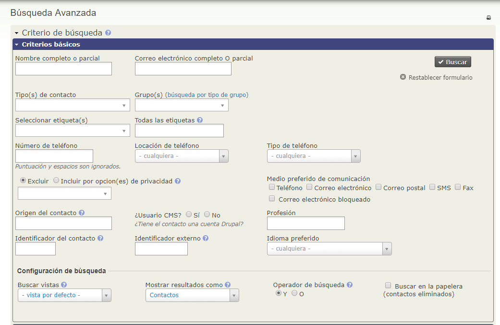

La búsqueda avanzada permite buscar a partir de toda la información de la que
dispone sobre sus contactos. Por ejemplo, podría encontrar ¨todos los contactos
de Venezuela¨ o ¨todos los grupos de asesores¨. Si especifica dos o más
categorias de información, la búsqueda muestra cada contacto que coincide con
todas las categorias. Por ejemplo, puede combinar los dos criterios que acabamos
de mencionar para encontrar ¨todos los miembros del grupo de asesores de
Venezuela¨.

Puede acceder a la pantalla de Búsqueda avanzada desde el menú de navegación
**Buscar > Búsqueda Avanzada**. En esta pantalla, los criterios de búsqueda
están agrupados en secciones que hacen referencia a distintos tipos de datos que
puede buscar, como direcciones, notas e información sobre componentes como
Contribuciones o Eventos. Cada grupo de criterios se muestra en una barra azul
(conocida como ¨acordeón¨ porque se expande cuando haces clic sobre ella). Por
ejemplo, si quiere buscar todas las personas de entre 16 y 18 años, haga clic en
el acordeón de Demografía. Cuando se abra, puede elegir la fecha de nacimiento
que le interese.

#### Muestra de la configuración de resultados

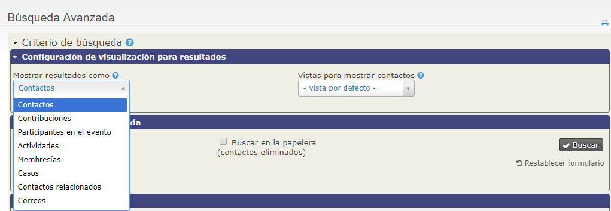

La búsqueda avanzada muestra por defecto los resultados como registros de
contacto. Sin embargo, existe la posibilidad de realizar la búsqueda a partir de
otro tipo de registros. Por ejemplo, puede realizar una búsqueda para encontrar
a las personas que renovaron su membresía la semana pasada. Podría realizar la
búsqueda a partir de registros de membresía y no contactos para así exportar los
campos nombre, dirección y fecha de expiración de la membresía. Con esta
información podría crear, y luego enviar, tarjetas de membresía a esos
contactos. Simplemente seleccione el tipo de registro que desee, del campo
desplegable **Mostrar resultados como** que encontrará en la parte de abajo del
cuadro de **Criterios básicos.**

#### Vistas para mostrar contactos

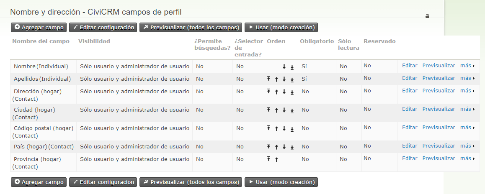

La búsqueda avanzada le permite cambiar las columnas que se muestran en los
resultados de su búsqueda. Las columnas por defecto son *Nombre, Calle, Ciudad,
Estado, Código Postal, País, Correo Electrónico y Teléfono*. Si quiere que se
muestren un conjunto de campos diferentes (quizás incluir un campo personalizado
o eliminar una columna que no necesite), puede crear un **Perfil** (Administrar
> Pantallas y campos personalizados > Perfiles) y elegir la casilla **Buscar
Vistas** en la opción ¨Utilizado para¨ . Asegúrese de que los campos del Perfil
estén configurados con visibilidad ¨Exponer públicamente y para listados¨ y
estén marcados como columnas de resultados. (Para más información sobre la
creación de Perfiles, consulte el capítulo de Perfiles, sección Configuración).

Por ejemplo, si quiere incluir columnas de *Sexo y Fecha* de Nacimiento y quiere
eliminar la columna de *País* puede crear un Perfil que contenga los campos de
fecha de nacimiento, sexo y dirección.

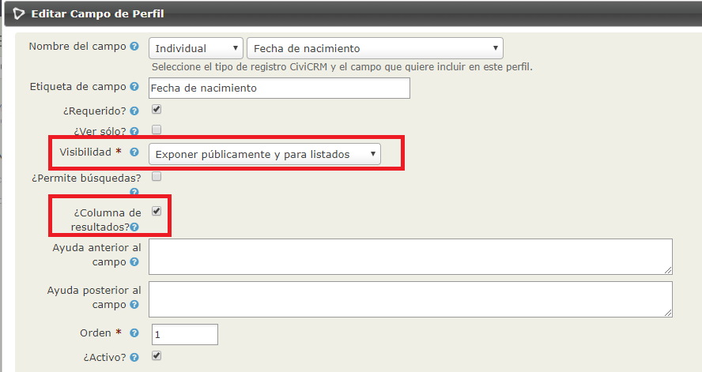

Lea más sobre crear perfiles en la sección de Perfiles del capítulo de
*Organizando su información.*

Combinar esta característica con la acción ¨Actualizar lotes a través del
Perfil¨proporciona un método muy práctico de ver y actualizar un conjunto
específico de campos a partir de un lote de contactos.

 

### Configuraciones de Búsqueda

El Operador de Búsqueda determina si los criterios de su búsqueda están
combinados con las funciones de Y o combinadas con las funciones de O. Por
ejemplo, si quisiera encontrar todos los individuos que están en el grupo
Voluntarios *Y* que tienen registrada una actividad de Formación de Voluntariado
debería utilizar el operador **Y**. Si lo que necesita es encontrar a todos los
individuos que se encuentren en el grupo de Voluntarios *O* que tengan
registrada una actividad de Formación de Voluntariado, debe utilizar el operador
**O**.

La Búsqueda en la Papelera le permite buscar contactos que han sido borrados
pero no de manera permanente. Cuando un contacto se borra, toda la información
relacionada se mueve a la papelera. Solo los usuarios con permisos especiales
podrán buscar y recuperar contactos de la papelera.

 

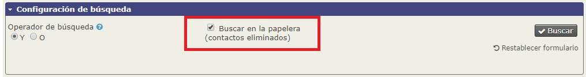

 

### El Filtro de Rangos de Fecha

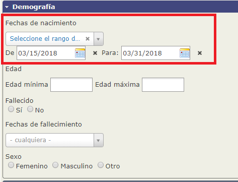

La mayoría de buscadores de elementos incluyen un filtro de rangos de fechas.
Las siguientes imágenes muestran ejemplos de dos tipos de rangos que se pueden
utilizar:

-   utilizando un rango de fechas absoluto p.ej. "1 Ene 2010" a "31 Julio 2010"

-   utilizando un rango de fechas relativo, p.ej. "Semana anterior"

Los rangos de fechas Relativos son especialmente útiles para búsquedas de grupos
grandes, configurados para incluir contactos que comparten un conjunto de
características o actividades (Grupos Inteligentes). Para más información
consulte el capítulo de *Grupos y Etiquetas*.

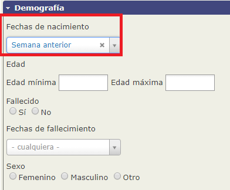

Por ejemplo, puede realizar una búsqueda por rango de fechas relativo para
encontrar la siguiente información:

-   Contactos que han realizado contribuciones en los últimos 7 días (rango de
    fecha Relativo - ¨Últimos 7 días¨).

-   Participantes de eventos registrados este año (fiscal) - (rango de fecha
    Relativa - "Este Año")

-   Contactos que tienen una edad específica

Los filtros de fechas relativos basados en los intervalos de tiempo ¨semana¨
asumen que el domingo es el primer día de la semana. Esto no es cierto en todos
los países, por ejemplo en Europa y muchos países de la región Asia/Pacífico,
donde consideran que el lunes es el primer día de la semana. Para configurar qué
día es el primer día de la semana, vaya a **Administrar > Localización >
Formatos de Fechas.**

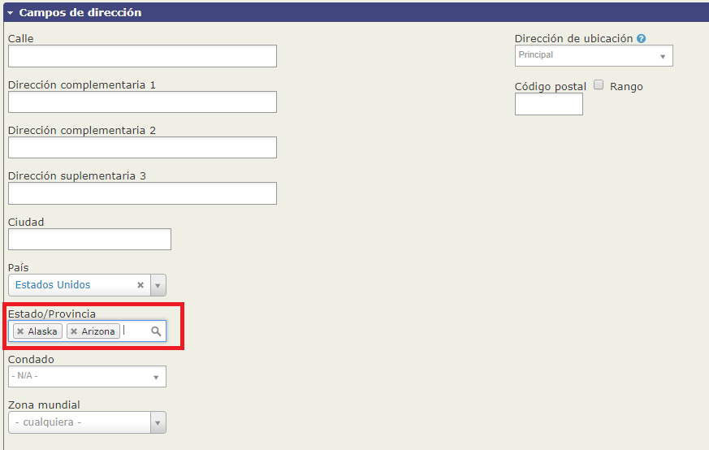

#### **Combinar criterios de búsqueda**

Se pueden combinar distintos criterios de búsqueda al mismo tiempo. Por ejemplo,
si dentro de los Criterios básicos selecciona la etiqueta ¨gran donante¨ y el
país ¨México¨, la búsqueda le devolverá los grandes donantes de México. La
búsqueda no le devolverá los grandes donantes que *no* son de México, ni tampoco
los contactos de México que *no* son grandes donantes.

Puede cambiar el operador de búsqueda por defecto de *Y* a *O* en la
Configuración de Búsqueda.

También tiene la opción de elegir varias opciones de búsqueda a través de las
casillas que ofrecen más de un valor, estas opciones están también configuradas
para incluir todos los criterios seleccionados en la búsqueda (operador Y). Por
ejemplo, si quiere buscar contactos cuyo método de comunicación preferido es
tanto el Correo Electrónico como los SMS puede utilizar esta opción.

Otra opción es a través de campos que le permiten elegir más de un valor de una
lista desplegable, estos valores siempre se combinan con el operador ¨O¨. Por
ejemplo, si quisiera encontrar contactos que viven en Alaska o en Arizona,
podría utilizar esta opción.

Contructor de Búsquedas
-----------------------

La búsqueda avanzada le permite elegir entre un amplio rango de criterios en un
panel fácil de usar, pero esto tiene limitaciones. El constructor de búsquedas
le permite definir su propia búsqueda y organizar los opciones de búsqueda según
sus necesidades específicas.

El constructor de búsqueda le permite elegir entre un rango de operadores:

 

| Operador                  | Propósito                                                                                                                                      | Ejemplo                                                                                                                          |
|---------------------------|------------------------------------------------------------------------------------------------------------------------------------------------|----------------------------------------------------------------------------------------------------------------------------------|
| =                         | Igual. Coteja los valores exactos que usted haya especificado                                                                                  | **"Nombre" = "Bob"** encontrará todos los contactos que tienen como ¨nombre¨exactamente "Bob"                                    |
| ≠                         | No es igual. Coteja todos los valores que no son iguales al especificado.                                                                      | **"Sexo" ≠ "Femenino"** econtrará todos los contactos que no son de sexo femenino                                                |
| \> , ≥                    | Mayor que, mayor o igual a                                                                                                                     | **"Fecha de Nacimiento" ≥ "1 Enero 2000"** econtrará los contactos nacidos el 1 de enero del 2000 o en una fecha posterior       |
| \< , ≤                    | Menor que, menor o igual que                                                                                                                   | **"Apellido" \< "J"** encontrará los contactos cuyo nombre comience con una letra que esté en el alfabeto antes de la letra ¨J¨. |
| En                        | El valor es alguno de los que ha especificado                                                                                                  | "Grupo" En "Miembros del Consejo, Empleados" encontrará contactos que estén en alguno de los dos grupos especificados            |
| Como                      | Igual que el operador = , pero mantiene el % del caracter de comodín                                                                           | **"Apellido" Como "Gree%"** encontrará contactos cuyo apellido comience con "Gree" (Green, Greenberg, etc)                       |
| Regex                     | Igual que el operador = , pero mantiene todos los operadores de expresiones regulares. Visite http://en.wikipedia.org/wiki/Regular_expressions | **"Apellido" Regex "[a-c]"** encontrará contactos cuyos apellidos comiencen por las letras A, B o C.                             |
| Está Vacio, No está Vacio | Vacio significa que el campo existe y es igual al número cero o que no contiene nada.                                                          | **"Ciudad" Está Vacio** encontrará todos los contactos que tienen una dirección pero que tienen el campo Ciudad vacio            |
| Es nulo, No es Nulo       | Nulo significa que el campo no existe o que no contiene nada.                                                                                  | **"Ciudad" Es Nulo** encontrará todos los contactos que no tienen ningún dato de dirección                                       |

El Constructor de Búsquedas le permite combinar criterios con grupos múltiples
de Y y O. Para utilizar la opción Y (significa encontrar resultados que
coincidan con todos los criterios especificados), haga clic en **Otro campo de
búsqueda** e introduzca los criterios en **Incluir Contactos donde.** Para
utilizar la opción O (significa encontrar resultados que coincidan con alguno de
los dos criterios), introduzca un criterio en **Incluir contactos donde** y el
otro bajo la opción **También incluir contactos donde**. En el siguiente ejemplo
verá la búsqueda de mujeres nacidas después del uno de enero del 2000 O miembros
de los grupos de administradores O Consejo Asesor:

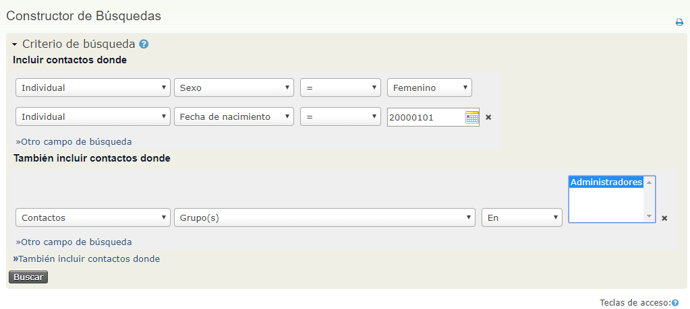

Los resultados de su búsqueda contendrán el nombre del contacto, más una columna
para cada criterio de búsqueda que haya definido. Si quiere exportar sus
resultados de búsqueda, el fichero de exportación contendrá esas mismas
columnas.

Como para otras búsquedas, puede elegir entre una lista de acciones para aplicar
a los resultados de su búsqueda. Si quisiera exportar resultados, puede
seleccionar campos para exportar. Tenga en cuenta que los campos que haya
buscado se exportarán por defecto junto con aquellos que haya seleccionado.

También puede guardar su búsqueda con el Constructor de búsquedas como un Grupo
Inteligente. Para más información sobre Grupos Inteligentes, vaya al capítulo de
Grupos y Etiquetas.

Búsqueda de Texto Completo
--------------------------

Puede utilizar esta búsqueda para todos los campos de **texto** de la base de
datos. Es especialmente útil, por ejemplo, si puede recordar palabras
específicas que haya usado pero no puede recordar dónde las ha puesto. Por
ejemplo, digamos que ha grabado una actividad con un contacto y ha añadido
palabras específicas a la descripción pero ha olvidado el nombre del contacto.
Puede utilizar la búsqueda por texto Completo para encontrar el contacto y la
actividad a través de las palabras que recuerde de la descripción.

Búsquedas por componentes
-------------------------

La mayoría de componentes de CiviCRM ofrecen una búsqueda de la información que
poseen, como **Encontrar contribuciones, Encontrar miembros**, etc. Estas
fórmulas de búsqueda funcionan de forma similar a la **Búsqueda Avanzada** pero,
en este caso, los resultados encontrados muestran filas de los componentes
principales asociadas con el resto de componentes, en lugar de los contactos.
**Encontrar Miembros** devuelve membresías, **Encontrar Participantes** muestra
registros en eventos, **Encontrar Contribuciones** devuelve contribuciones y así
sucesivamente.

Cada búsqueda por componente tiene su propia lista de Acciones. Consulte la
sección *Componentes* para más detalles.

Tenga en cuenta que puede también puede utilizar la búsqueda Avanzada
conjuntamente con **Mostrar resultados como** (Criterios básicos - Configuración
de búsqueda) para buscar componentes basados en los criterios disponibles en
búsqueda avanzada. Por ejemplo, puede encontrar los asistentes a todos los
eventos de entre los contactos que también son miembros.

Búsquedas personalizadas
------------------------

Las búsquedas Personalizadas están diseñadas para solucionar problemas
específicos que no pueden solucionarse fácilmente utilizando la **Búsqueda
avanzada** o el **Constructor de búsquedas**.

Vaya a **Búscar** > Búsquedas Personalizadas** en el menú de navegación y
mire en la lista de búsquedas personalizadas disponilbles. Estas búsquedas
personalizadas han sido elaboradas por miembros de la comunidad CiviCRM para
cubrir sus propias necesidades, y también contribuir con la comunidad al
compartir con otros usuarios que necesitan la misma búsqueda o una búsqueda
similar. Merece la pena dedicar un tiempo a explorar estas búsquedas ya que
algunas pueden ser útiles para usted y le podrán dar una idea del tipo de cosas
que son posibles.

Aunque algunas de estas búsquedas pueden realizarse a través de la Búsqueda
Avanzada (especialmente en las últimas versiones), las búsquedas personalizadas
también están diseñadas para mostrar resultados según su búsqueda y pueden
proporcionarle resultados con columnas más útiles para sus necesidades. Aquí
encontrará una breve descripción de las búsquedas personalizadas disponibles.

### Encontrar contactos en un grupo y no en otro

Este es, probablemente la búsqueda personalizada más popular.

Si usa la opción de Búsqueda Avanzada y selecciona varios grupos en la lista de
Grupos en la parte de arriba, tratará la búsqueda como una búsqueda O, y le
devolverá resultados de contactos que están en cualquiera de los grupos que haya
seleccionado. Si quiere encontrar contactos que pertenezcan a todos los grupos
seleccionados, tendrá que utilizar el Constructor de búsquedas.

Existe también una búsqueda personalizada integrada, ¨Incluir/Excluir contacto
en un grupo/Etiqueta¨, que le permite encontrar contactos que están en un grupo
pero no en otro. Puede encontrarlo en **Buscar > Búsquedas Personalizadas** en
el menú de navegación.

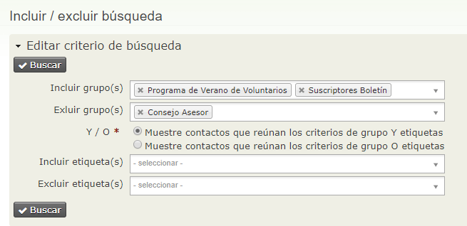

Combinando las opciones Incluir y Excluir, puede encontrar contactos que están
en un grupo y excluir solo los miembros del grupo que cumplan otros criterios.
Por ejemplo, podría utilizar esta opción, si quisiera encontrar todos los
contactos suscritos a una Newsletter o voluntarios, pero quisiera excluir a los
miembros del Consejo de Asesores, y así crear una nueva lista de envío de correo
para enviar un mensaje dirigido a los círculos más externos de su base de datos.

### **Nombre y Estado de Familia​**

Buscar familias en un estado o provincia.

Nota: los estados o provincias disponibles en su búsqueda dependen de su
configuración de localización. Puede añadir países adicionales en la opción
**Administrar > Configurar > Configuración Global > Localización**. Añada
¨Estados y Provincias disponibles¨, pero tenga en cuenta que este cambio también
afectará los perfiles que incluyen campos de país o estado/provincia.

### **Contribución Agregada​**

Encuentra agregados totales de contribuciones de contactos en un perido de
fechas determinado.

### **Envío Postal​**

Busca contactos en un grupo dado y muestra los resultados con la información de
correo electrónico. Puede usar esta búsqueda para actualizar lotes de
información de contactos, enviar un correo electrónico, exportar contactos y
otras acciones.

### **Búsqueda de Proximidad​**

Busca contactos ubicados a menos de X millas/kilómetros de un área geográfica
determinada.

1.  Vaya a **Buscar > Búsquedas Personalizadas > Búsqueda de Proximidad**

2.  Introduzca la distancia en millas o kilómetros

3.  Introduzca el país en el que quiere realizar la búsqueda

4.  Introduzca cualquier otro parámetro que desee dar a su búsqueda

5.  Haga clic en **Buscar**.

**Consejo:** Puede también incorporar Búsqueda de Proximidad en un perfil que
haya configurado para usar en un formulario de búsqueda.

### **Evento Agregado​**

Busca pagos relacionados con eventos para un determinado evento en un rango de
fechas determinado. También puede limitar los resultados para mostrar solo pagos
por tarjetas de crédito o solo beneficiarios. Consulte los informes de Eventos
para ver más opciones de búsquedas de eventos.

### **Búsqueda de Actividad​**

Puede encontrar actividades utilizando cualquier criterio o todos los criterios
relacionados con actividades. Esto también es posible desde la opción de
*Mostrar restultados como* de la Búsqueda avanzada.

### **Detalles del listado de precios para participantes del evento**

Puede conseguir información detallada sobre las diferentes elecciones de pago de
los participantes a un evento. Por ejemplo, puede ver quién ha pagado solo por
la inscripción al evento, quién ha pagado por los talleres adicionales y quién
ha pagado por la cena.

### **Buscar cantidades de contribuiones por etiqueta​**

Busque en cualquier etiqueta de contribución dentro de un rango de fechas.

### **Rango de códigos postales**

Encuentre contactos en un rango específico de códigos postales . Esto es útil
para envios de correo selectivo o para la realización de encuentas en un área
geográfica específica.

1.  Vaya a **Buscar > Búsquedas Personalizadas > Rango de códigos postales**

2.  Introduzca el inicio y la finalización del rango de códigos postales.

3.  Haga clic en **Buscar**

### **Fecha agregada a​ CiviCRM**

Busca contactos que han sido añadidos en un periodo de tiempo determinado.
*Incluir grupo* muestra solo aquellos añadidos dentro de un marco de tiempo
determinado que también están en ese grupo. *Excluir grupo* excluye los miembros
del grupo de la búsqueda.

### **Listado de valores múltiples personalizado**

Busca por información de valores múltiples personalizados.

### **Contribuciones hechas en el año X y no en el año Y​**

Busca contribuciones que se han realizado en un año pero no en otro. Esta opción
es útil para el seguimiento de donantes semi-regulares y para animarlos a donar
de forma más regular. Consulte los informes de LYBUNT y SYBUNT para más
información..

No se require ninguno de los campos; puede elegir tanto un rango de cantidades
determindado como un periodo determinado y si quiere excluir cantidades mínimas
o máximas.

Tiene la posibilidad de escribir sus propias búsquedas personalizadas, pero
tendrá que saber manejar MySQL y PHP. Consulte la wiki de desarrollador en
<http://wiki.civicrm.org/confluence/display/CRMDOC/Develop> para más
información. Si crea una búsqueda personalizada que cree que podría ser útil
para otros, considere compartirla con la comunidad.

El flujo de trabajo ¨búsqueda-acción¨
-------------------------------------

Una vez recuperados los resultados de su búsqueda puede realizar una serie de
acciones. Una casilla de Acciones aparece sobre los resultados. Puede
seleccionar, bien todos los registros, o bien registros determinados, y llevar a
cabo una acción. Puede consultar el capítulo Tareas diarias para conocer en
detalle, las diferentes acciones que se ofrecen.

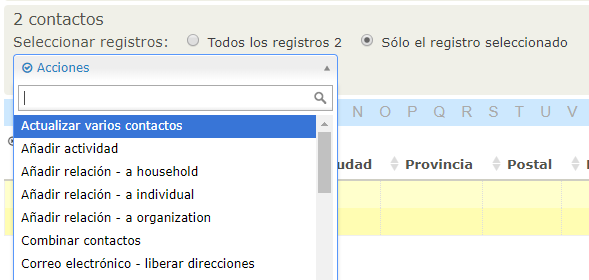

Algunas de las acciones más utilizadas son Añadir contactos a un grupo, Exportar
Contactos, Mapear Contactos y Crear e imprimir Etiquetas de envios de correo
(para usar mapas de contactos necesitará configurar Mapping y Geocoding,
consulte el capítulo *Instalar* de la sección de *Configuración* de este manual,
para más información).

Por ejemplo, para enviar un correo electrónico a un determinado número de
contactos, marque los contactos por los que está interesado y luego seleccione
**Enviar email a los contactos** en la lista de acciones desplegable.

Ventana emergente de detalles de contacto
-----------------------------------------

Puede ver una ventana emergente con información detallada para cualquier
contacto listado en los resultados de su búsqueda, si desplaza el cursor sobre
el icono del contacto en la columna izquierda, como podrá ver en la imagen de
abajo. Puede ajustar los campos mostrados en esta ventana si modifica los campos
incluidos en el perfil del ¨Icono Resumen¨ **(Administrar > Pantallas y campos
personalizados > Perfiles).**

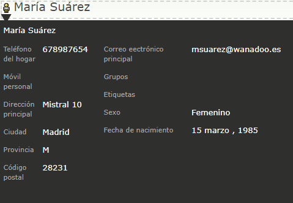

El comodín (%)
--------------

Si entiende el uso de los comodines, incrementará sus oportunidades de búsqueda.
Un comodín representa cualquier caracter (letra, cifras, marcas de puntuación).
En CiviCRM, el comodín se representa con el símbolo % (puede que esté
familiarizado con otros símbolos como * de otras aplicaciones).

Por ejemplo, suponga que alguien le pide que encuentre un contacto con un nombre
parecido a ¨Michael¨ del estilo de ¨Michelle¨o ¨Michal¨. Si busca por ¨Mich%¨
encontrará estas variaciones, incluyendo un contacto que se supone que se llama
¨Michael¨ pero cuyo nombre estaba escrito erróneamente como ¨Micheal¨. Los
comodines pueden ser utilizados antes, después o incluso entre palabras. Por
ejemplo, una búsqueda por ¨Mich%el¨ excluirá ¨Michal¨y ¨Micheal¨pero todavía
encontrará ¨Michelle¨ y ¨Michael¨.

Sensible a las mayúsculas
-------------------------

Tenga en cuenta que cuando busca una serie de caracteres, la búsqueda no es
sensible a las mayúsculas. Por ejemplo, si busca ¨brooklyn¨, la búsqueda le
devolverá series con letras mayúsculas, si la serie existe, p.ej. ¨Brookyn¨ o
¨BROOKLYN¨. Si introduce ¨mi%el¨en letras minúsculas también buscará contactos
con la letra mayúscula ¨M¨en su nombre.
